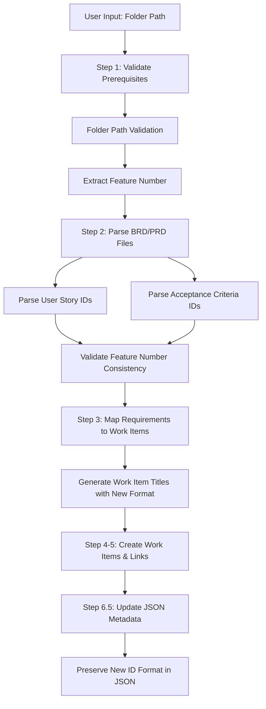
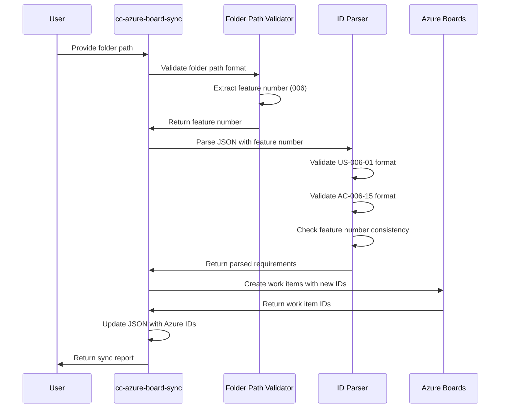

# Design Document: Azure Sync ID Consistency

## Overview

The azure-sync-id-consistency feature updates the cc-azure-board-sync skill to use the same ID format convention as other PRD generation skills (cc-gen-prd, cc-gen-prd-lite, cc-gen-brd-prd, cc-gen-tech-spec). This ensures consistency across the entire skill ecosystem and eliminates mismatches when users generate PRDs with IDs like `US-006-01` and then sync to Azure Boards.

### Current State

The cc-azure-board-sync skill currently uses a simplified ID format:
- User Stories: `US-001`, `US-002`, etc.
- Acceptance Criteria: `AC-001-01`, `AC-001-02`, etc.

This format lacks the feature number component that all other skills use, creating a disconnect between document generation and Azure synchronization.

### Target State

After this feature is implemented, cc-azure-board-sync will use the consistent ID format:
- User Stories: `US-{feature_number}-{seq}` (e.g., `US-006-01`)
- Acceptance Criteria: `AC-{feature_number}-{seq}` (e.g., `AC-006-15`)

The feature number will be extracted from the folder path (e.g., `prds/006_about_founder_name/` → feature number `006`).

### Key Benefits

1. **Consistency**: All skills use the same ID format, reducing cognitive load for users
2. **Traceability**: IDs clearly indicate which feature they belong to
3. **Scalability**: Feature numbers allow multiple features to coexist without ID conflicts
4. **Validation**: Feature number matching enables early detection of document errors

## Architecture

### Component Overview

The azure-sync-id-consistency feature modifies the cc-azure-board-sync skill at four key integration points:



### Integration Points

#### 1. Step 1: Validate Prerequisites (NEW)
- Add folder path validation before file validation
- Extract and validate 3-digit feature number from folder name
- Store feature number for use in subsequent steps

#### 2. Step 2: Parse BRD/PRD Files (MODIFIED)
- Update User Story ID parsing regex from `US-\d+` to `US-(\d{3})-(\d{2})`
- Update Acceptance Criteria ID generation to use `AC-{feature_number}-{seq}`
- Add feature number consistency validation

#### 3. Step 3: Map Requirements to Work Items (MODIFIED)
- Use new ID format in work item titles
- Use the canonical ID format in work item titles and descriptions

#### 4. Step 6.5: Update JSON Metadata File (MODIFIED)
- Preserve new ID format when adding Azure work item IDs
- Ensure `id` fields remain unchanged (e.g., `US-006-01` stays `US-006-01`)

### Data Flow



## Components and Interfaces

### 1. Folder Path Validator

**Purpose**: Extract and validate the 3-digit feature number from the folder path.

**Input**:
- `folderPath` (string): Full path to the folder containing PRD files (e.g., `prds/006_about_founder_name/`)

**Output**:
- `featureNumber` (string): 3-digit feature number with leading zeros preserved (e.g., `"006"`)
- `error` (string | null): Error message if validation fails

**Validation Rules**:
1. Extract folder name from full path (last segment before trailing slash)
2. Folder name must match pattern: `^(\d{3})_(.+)$`
3. First 3 characters must be digits (0-9)
4. 4th character must be underscore (_)
5. Numeric prefix must be between 001 and 999 (reject 000)
6. Leading zeros must be preserved

**Error Messages**:
```typescript
interface ValidationError {
  type: 'MISSING_PREFIX' | 'INVALID_FORMAT' | 'OUT_OF_RANGE' | 'MISSING_UNDERSCORE';
  message: string;
  expected: string;
  actual: string;
}
```

**Example**:
```
Input: "prds/006_about_founder_name/"
Output: { featureNumber: "006", error: null }

Input: "prds/about_founder_name/"
Output: { 
  featureNumber: null, 
  error: {
    type: 'MISSING_PREFIX',
    message: 'Folder name must start with exactly 3 digits',
    expected: '{NNN}_{feature_name} (e.g., 006_about_founder_name)',
    actual: 'about_founder_name'
  }
}
```

### 2. User Story ID Parser

**Purpose**: Parse User Story IDs in the new format and extract components.

**Input**:
- `id` (string): User Story ID from JSON (e.g., `"US-006-01"`)
- `expectedFeatureNumber` (string): Feature number from folder path (e.g., `"006"`)

**Output**:
```typescript
interface ParsedUserStoryId {
  valid: boolean;
  featureNumber: string | null;  // e.g., "006"
  sequence: string | null;        // e.g., "01"
  featureNumberMatch: boolean;    // Does it match expectedFeatureNumber?
  error: string | null;
}
```

**Parsing Logic**:
1. Apply regex: `^US-(\d{3})-(\d{2})$`
2. Extract feature number from capture group 1
3. Extract sequence number from capture group 2
4. Compare extracted feature number with expected feature number
5. Return validation result

**Example**:
```
Input: id="US-006-01", expectedFeatureNumber="006"
Output: {
  valid: true,
  featureNumber: "006",
  sequence: "01",
  featureNumberMatch: true,
  error: null
}

Input: id="US-007-01", expectedFeatureNumber="006"
Output: {
  valid: true,
  featureNumber: "007",
  sequence: "01",
  featureNumberMatch: false,
  error: "Feature number mismatch: expected 006, found 007"
}

Input: id="US-001", expectedFeatureNumber="006"
Output: {
  valid: false,
  featureNumber: null,
  sequence: null,
  featureNumberMatch: false,
  error: "Invalid format: expected US-{feature_number}-{seq}, found US-001"
}
```

### 3. Acceptance Criteria ID Generator

**Purpose**: Generate Acceptance Criteria IDs in the new format with global sequential numbering.

**Input**:
- `featureNumber` (string): 3-digit feature number (e.g., `"006"`)
- `globalSequence` (number): Global sequence counter across all user stories (e.g., 15)

**Output**:
- `id` (string): Generated AC ID (e.g., `"AC-006-15"`)

**Generation Logic**:
1. Format sequence number with zero-padding to 2 digits
2. Construct ID: `AC-${featureNumber}-${paddedSequence}`
3. Increment global sequence counter for next criterion

**Example**:
```
Input: featureNumber="006", globalSequence=1
Output: "AC-006-01"

Input: featureNumber="006", globalSequence=15
Output: "AC-006-15"

Input: featureNumber="006", globalSequence=99
Output: "AC-006-99"
```

**Global Sequential Numbering**:
- Counter starts at 1 for the first acceptance criterion in the feature
- Counter increments for each criterion across all user stories
- Example: If US-006-01 has 3 criteria and US-006-02 has 2 criteria:
  - US-006-01: AC-006-01, AC-006-02, AC-006-03
  - US-006-02: AC-006-04, AC-006-05

### 4. Feature Number Consistency Validator

**Purpose**: Validate that all IDs in a document use the same feature number.

**Input**:
- `userStories` (array): Array of parsed user story objects with IDs
- `expectedFeatureNumber` (string): Feature number from folder path

**Output**:
```typescript
interface ConsistencyReport {
  valid: boolean;
  mismatchedIds: Array<{
    id: string;
    expectedFeatureNumber: string;
    actualFeatureNumber: string;
  }>;
  totalIds: number;
  mismatchCount: number;
}
```

**Validation Logic**:
1. Iterate through all user story IDs
2. Parse each ID to extract feature number
3. Compare with expected feature number
4. Collect mismatches
5. Generate report

**Example**:
```
Input: 
  userStories=[
    { id: "US-006-01", ... },
    { id: "US-007-01", ... },
    { id: "US-006-02", ... }
  ],
  expectedFeatureNumber="006"

Output: {
  valid: false,
  mismatchedIds: [
    {
      id: "US-007-01",
      expectedFeatureNumber: "006",
      actualFeatureNumber: "007"
    }
  ],
  totalIds: 3,
  mismatchCount: 1
}
```

### 5. JSON Metadata Updater

**Purpose**: Update JSON metadata file with Azure work item IDs while preserving the new ID format.

**Input**:
- `jsonContent` (object): Parsed JSON metadata
- `workItemMapping` (Map): Map of source IDs to Azure work item IDs
- `featureNumber` (string): Feature number for validation

**Output**:
- `updatedJson` (object): JSON with Azure work item IDs added
- `preservedIds` (array): List of IDs that were preserved in original format

**Update Logic**:
1. Preserve all original `id` fields unchanged
2. Add `azureWorkItemId` field to each user story
3. Add `azureWorkItemUrl` field to each user story
4. For acceptance criteria:
   - If currently strings, convert to objects with `text` field
   - Add `azureWorkItemId` and `azureWorkItemUrl` fields
5. Add root-level Azure metadata

**Example**:
```json
// Before
{
  "userStories": [
    {
      "id": "US-006-01",
      "title": "User Login",
      "acceptanceCriteria": [
        "User can enter credentials"
      ]
    }
  ]
}

// After
{
  "userStories": [
    {
      "id": "US-006-01",  // PRESERVED
      "title": "User Login",
      "azureWorkItemId": 12346,
      "azureWorkItemUrl": "https://dev.azure.com/...",
      "acceptanceCriteria": [
        {
          "text": "User can enter credentials",
          "azureWorkItemId": 12347,
          "azureWorkItemUrl": "https://dev.azure.com/..."
        }
      ]
    }
  ]
}
```

## Data Models

### Folder Path Validation Result

```typescript
interface FolderPathValidationResult {
  valid: boolean;
  featureNumber: string | null;  // "006", "010", "099"
  folderName: string;             // "006_about_founder_name"
  error: ValidationError | null;
}

interface ValidationError {
  type: 'MISSING_PREFIX' | 'INVALID_FORMAT' | 'OUT_OF_RANGE' | 'MISSING_UNDERSCORE';
  message: string;
  expected: string;  // Pattern description
  actual: string;    // What was provided
}
```

### Parsed User Story ID

```typescript
interface ParsedUserStoryId {
  valid: boolean;
  originalId: string;             // "US-006-01"
  featureNumber: string | null;   // "006"
  sequence: string | null;        // "01"
  featureNumberMatch: boolean;    // true if matches expected
  error: string | null;
}
```

### Parsed Acceptance Criteria ID

```typescript
interface ParsedAcceptanceCriteriaId {
  valid: boolean;
  originalId: string;             // "AC-006-15"
  featureNumber: string | null;   // "006"
  sequence: string | null;        // "15"
  featureNumberMatch: boolean;    // true if matches expected
  error: string | null;
}
```

### Work Item Mapping

```typescript
interface WorkItemMapping {
  sourceId: string;               // "US-006-01" or "AC-006-15"
  azureWorkItemId: number;        // 12346
  azureWorkItemUrl: string;       // "https://dev.azure.com/..."
  type: 'Feature' | 'User Story' | 'Task';
  title: string;
}
```

### Consistency Validation Report

```typescript
interface ConsistencyReport {
  valid: boolean;
  expectedFeatureNumber: string;  // "006"
  totalUserStories: number;
  totalAcceptanceCriteria: number;
  mismatchedUserStories: Array<{
    id: string;
    actualFeatureNumber: string;
  }>;
  mismatchedAcceptanceCriteria: Array<{
    id: string;
    actualFeatureNumber: string;
  }>;
  mismatchCount: number;
}
```

### JSON Metadata Structure (Updated)

```typescript
interface JsonMetadata {
  project: string;
  featureName: string;
  featureId: string;
  description?: string;
  
  // Added by sync
  azureWorkItemId?: number;
  azureWorkItemUrl?: string;
  lastSyncedToAzure?: string;     // ISO 8601 timestamp
  azureOrganization?: string;
  azureProject?: string;
  
  userStories: Array<{
    id: string;                    // "US-006-01" (PRESERVED)
    title: string;
    description: string;
    priority?: number;
    technicalSpecSection?: string;
    
    // Added by sync
    azureWorkItemId?: number;
    azureWorkItemUrl?: string;
    
    acceptanceCriteria: Array<
      string | {                   // String converted to object during sync
        text: string;
        azureWorkItemId?: number;
        azureWorkItemUrl?: string;
      }
    >;
  }>;
}
```


## Correctness Properties

*A property is a characteristic or behavior that should hold true across all valid executions of a system—essentially, a formal statement about what the system should do. Properties serve as the bridge between human-readable specifications and machine-verifiable correctness guarantees.*

### Property 1: Folder Path Validation and Feature Number Extraction

*For any* folder path with a valid format `{NNN}_{feature_name}` where NNN is a 3-digit number between 001 and 999, the skill should extract the feature number as a string with leading zeros preserved, and for any folder path that does not match this format, the skill should reject it with a descriptive error message.

**Validates: Requirements 1.1, 1.2, 1.3, 1.4, 1.5, 1.6, 4.1, 4.2, 4.3, 4.4, 4.5, 6.1**

### Property 2: User Story ID Parsing Round Trip

*For any* User Story ID in the format `US-{feature_number}-{seq}` where feature_number is a 3-digit string and seq is a 2-digit string, parsing the ID should extract both components correctly, and reconstructing an ID from those components should produce the original ID.

**Validates: Requirements 2.1, 2.2, 2.3**

### Property 3: User Story ID Format Validation

*For any* JSON metadata file containing user stories, the skill should validate that each User Story ID matches the format `US-{feature_number}-{seq}`, and for any ID that does not match, the skill should log a warning and continue processing.

**Validates: Requirements 2.4, 2.5**

### Property 4: User Story Feature Number Consistency

*For any* set of User Story IDs and a folder path feature number, the skill should validate that all User Story IDs contain the same feature number as extracted from the folder path, and should log warnings for any mismatches while continuing to process.

**Validates: Requirements 2.6, 6.2, 6.4**

### Property 5: Acceptance Criteria ID Parsing Round Trip

*For any* Acceptance Criteria ID in the format `AC-{feature_number}-{seq}` where feature_number is a 3-digit string and seq is a 2-digit string, parsing the ID should extract both components correctly, and reconstructing an ID from those components should produce the original ID.

**Validates: Requirements 3.1, 3.2, 3.3**

### Property 6: Acceptance Criteria ID Generation

*For any* feature number and sequence number, generating an Acceptance Criteria ID should produce a string in the format `AC-{feature_number}-{seq}` where the feature number is preserved with leading zeros and the sequence is zero-padded to 2 digits.

**Validates: Requirements 3.4**

### Property 7: Global Sequential Numbering for Acceptance Criteria

*For any* set of user stories within a feature, when generating Acceptance Criteria IDs, the sequence numbers should increment globally across all user stories (not reset per user story), starting from 01 for the first criterion and incrementing by 1 for each subsequent criterion.

**Validates: Requirements 3.5**

### Property 8: Acceptance Criteria Feature Number Consistency

*For any* set of Acceptance Criteria IDs and a folder path feature number, the skill should validate that all AC IDs contain the same feature number as extracted from the folder path, and should log warnings for any mismatches while continuing to process.

**Validates: Requirements 3.6, 6.3, 6.4**

### Property 9: Mismatch Count Reporting

*For any* synchronization operation with a set of IDs (User Stories and Acceptance Criteria), the synchronization report should contain an accurate count of IDs with mismatched feature numbers, equal to the number of IDs that do not match the folder path feature number.

**Validates: Requirements 6.6**

### Property 10: Invalid ID Error Messages

*For any* invalid ID (User Story or Acceptance Criteria), the error message should include the expected format for that ID type, the actual value that failed validation, and the expected format pattern.

**Validates: Requirements 7.2, 7.3**

### Property 11: JSON ID Preservation During Update

*For any* JSON metadata file with User Story IDs and Acceptance Criteria IDs, after updating the file with Azure work item IDs, all original `id` fields should remain unchanged (preserved exactly as they were before the update).

**Validates: Requirements 8.1**

### Property 12: Azure Work Item ID Addition to User Stories

*For any* user story in a JSON metadata file, after synchronization, the user story object should contain `azureWorkItemId` and `azureWorkItemUrl` fields in addition to all original fields.

**Validates: Requirements 8.2**

### Property 13: Azure Work Item ID Addition to Acceptance Criteria

*For any* acceptance criterion in a JSON metadata file, after synchronization, the criterion should be represented as an object containing `text`, `azureWorkItemId`, and `azureWorkItemUrl` fields (converting from string format if necessary).

**Validates: Requirements 8.3**

### Property 14: JSON Field Preservation During Update

*For any* JSON metadata file with arbitrary fields (priority, technicalSpecSection, description, etc.), after updating the file with Azure work item IDs, all original fields should be preserved with their original values unchanged.

**Validates: Requirements 8.5**

## Error Handling

### Error Categories

The azure-sync-id-consistency feature introduces three categories of errors:

1. **Fatal Errors** (halt processing):
   - Invalid folder path format
   - Folder path feature number out of range (000 or > 999)
   - Missing folder path

2. **Validation Warnings** (log and continue):
   - User Story ID format mismatch
   - Acceptance Criteria ID format mismatch
   - Feature number mismatch between folder path and IDs

3. **Informational Messages**:
   - Successful feature number extraction
   - Consistency validation passed
   - JSON update completed

### Error Message Format

All error messages follow a consistent structure:

```
[ERROR_TYPE] Error Message

Expected: {expected_pattern}
Actual: {actual_value}
Issue: {specific_issue_description}

{actionable_guidance}
```

**Example - Invalid Folder Path**:
```
[FATAL] Invalid folder name format

Expected: {NNN}_{feature_name} (e.g., 006_about_founder_name)
Actual: about_founder_name
Issue: Missing 3-digit numeric prefix at the start

Please provide a folder path with a name that starts with exactly 3 digits (001-999) followed by an underscore.
```

**Example - Feature Number Mismatch**:
```
[WARNING] Feature number mismatch in User Story ID

Expected: 006 (from folder path)
Actual: 007 (from User Story ID US-007-01)
Issue: User Story ID contains different feature number than folder path

This User Story will still be synced to Azure Boards, but the ID mismatch may indicate a documentation error.
```

### Error Recovery Strategies

1. **Folder Path Validation Failure**:
   - Display error message with expected pattern
   - Prompt user to provide corrected folder path
   - Re-validate until valid path provided
   - Do not proceed to file parsing

2. **ID Format Validation Failure**:
   - Log warning with ID and expected format
   - Continue processing other IDs
   - Include warning count in synchronization report
   - Allow work item creation to proceed

3. **Feature Number Mismatch**:
   - Log warning with expected and actual feature numbers
   - Continue processing (do not halt)
   - Track mismatch count
   - Report all mismatches in synchronization report
   - Create work items with IDs as specified in JSON

4. **JSON Update Failure**:
   - Log error with file path and error details
   - Do not fail the entire synchronization
   - Work items are still created in Azure Boards
   - Report JSON update failure in synchronization report

### Validation Order

To provide the best user experience, validations are performed in this order:

1. **Folder path validation** (Step 1) - Fail fast if path is invalid
2. **File existence validation** (Step 1) - Verify files exist before parsing
3. **JSON structure validation** (Step 2) - Verify JSON is parseable
4. **ID format validation** (Step 2) - Validate individual ID formats
5. **Feature number consistency** (Step 2) - Check all IDs match folder path
6. **Work item creation** (Steps 4-5) - Create work items in Azure Boards
7. **JSON update** (Step 6.5) - Update JSON with Azure IDs

This order ensures that:
- Users get immediate feedback on folder path issues
- File issues are caught before attempting to parse
- ID issues are identified before Azure API calls
- Work items are created even if JSON update fails

## Testing Strategy

### Dual Testing Approach

This feature will be tested using both unit tests and property-based tests to ensure comprehensive coverage:

**Unit Tests** will focus on:
- Specific examples of valid and invalid folder paths
- Edge cases (000, 001, 999, 1000)
- Error message content verification
- JSON transformation examples
- Integration between components

**Property-Based Tests** will focus on:
- Universal properties that hold for all inputs
- Randomized input generation for folder paths, IDs, and JSON structures
- Round-trip properties (parse then reconstruct)
- Consistency validation across large datasets
- Comprehensive input coverage

### Property-Based Testing Configuration

**Testing Library**: fast-check (JavaScript/TypeScript property-based testing library)

**Test Configuration**:
- Minimum 100 iterations per property test
- Each test references its design document property
- Tag format: `Feature: azure-sync-id-consistency, Property {number}: {property_text}`

### Property Test Specifications

#### Property 1: Folder Path Validation and Feature Number Extraction

**Generator Strategy**:
- Generate valid folder paths: `{001-999}_{random_name}`
- Generate invalid folder paths: missing digits, wrong format, out of range
- Generate edge cases: 000, 001, 999, 1000

**Test Logic**:
```typescript
// Feature: azure-sync-id-consistency, Property 1: Folder Path Validation and Feature Number Extraction
fc.assert(
  fc.property(
    fc.oneof(
      validFolderPathGenerator(),
      invalidFolderPathGenerator()
    ),
    (folderPath) => {
      const result = validateAndExtractFeatureNumber(folderPath);
      
      if (isValidFormat(folderPath)) {
        expect(result.valid).toBe(true);
        expect(result.featureNumber).toMatch(/^\d{3}$/);
        expect(result.featureNumber).toBe(extractExpectedFeatureNumber(folderPath));
      } else {
        expect(result.valid).toBe(false);
        expect(result.error).toBeDefined();
        expect(result.error.message).toContain('Expected');
      }
    }
  ),
  { numRuns: 100 }
);
```

#### Property 2: User Story ID Parsing Round Trip

**Generator Strategy**:
- Generate valid User Story IDs: `US-{001-999}-{01-99}`
- Ensure feature numbers have leading zeros
- Ensure sequence numbers are zero-padded

**Test Logic**:
```typescript
// Feature: azure-sync-id-consistency, Property 2: User Story ID Parsing Round Trip
fc.assert(
  fc.property(
    userStoryIdGenerator(),
    (originalId) => {
      const parsed = parseUserStoryId(originalId);
      const reconstructed = `US-${parsed.featureNumber}-${parsed.sequence}`;
      
      expect(parsed.valid).toBe(true);
      expect(reconstructed).toBe(originalId);
      expect(parsed.featureNumber).toMatch(/^\d{3}$/);
      expect(parsed.sequence).toMatch(/^\d{2}$/);
    }
  ),
  { numRuns: 100 }
);
```

#### Property 7: Global Sequential Numbering for Acceptance Criteria

**Generator Strategy**:
- Generate random sets of user stories (1-10 stories)
- Each story has random number of acceptance criteria (1-5 criteria)
- Generate random feature numbers

**Test Logic**:
```typescript
// Feature: azure-sync-id-consistency, Property 7: Global Sequential Numbering for Acceptance Criteria
fc.assert(
  fc.property(
    fc.array(userStoryWithCriteriaGenerator(), { minLength: 1, maxLength: 10 }),
    fc.integer({ min: 1, max: 999 }).map(n => n.toString().padStart(3, '0')),
    (userStories, featureNumber) => {
      const generatedIds = generateAcceptanceCriteriaIds(userStories, featureNumber);
      
      // Verify global sequential numbering
      let expectedSequence = 1;
      for (const id of generatedIds) {
        const parsed = parseAcceptanceCriteriaId(id);
        expect(parsed.sequence).toBe(expectedSequence.toString().padStart(2, '0'));
        expectedSequence++;
      }
      
      // Verify all IDs use the same feature number
      for (const id of generatedIds) {
        expect(id).toContain(`AC-${featureNumber}-`);
      }
    }
  ),
  { numRuns: 100 }
);
```

#### Property 11: JSON ID Preservation During Update

**Generator Strategy**:
- Generate random JSON metadata structures
- Include various ID formats (valid and edge cases)
- Include random additional fields

**Test Logic**:
```typescript
// Feature: azure-sync-id-consistency, Property 11: JSON ID Preservation During Update
fc.assert(
  fc.property(
    jsonMetadataGenerator(),
    workItemMappingGenerator(),
    (originalJson, workItemMapping) => {
      const updatedJson = updateJsonWithAzureIds(originalJson, workItemMapping);
      
      // Verify all original IDs are preserved
      for (let i = 0; i < originalJson.userStories.length; i++) {
        expect(updatedJson.userStories[i].id).toBe(originalJson.userStories[i].id);
      }
      
      // Verify Azure IDs were added
      for (const story of updatedJson.userStories) {
        expect(story.azureWorkItemId).toBeDefined();
        expect(story.azureWorkItemUrl).toBeDefined();
      }
    }
  ),
  { numRuns: 100 }
);
```

### Unit Test Specifications

#### Unit Test 1: Folder Path Edge Cases

**Test Cases**:
- `000_feature_name` → Invalid (out of range)
- `001_feature_name` → Valid (minimum)
- `999_feature_name` → Valid (maximum)
- `1000_feature_name` → Invalid (too many digits)
- `06_feature_name` → Invalid (too few digits)
- `feature_name` → Invalid (no digits)

#### Unit Test 2: Error Message Content

**Test Cases**:
- Verify error messages contain expected pattern
- Verify error messages contain actual value
- Verify error messages contain specific issue description
- Verify error messages contain actionable guidance

#### Unit Test 3: JSON Transformation Example

**Test Case**:
- Start with sample JSON (from requirements)
- Apply Azure work item IDs
- Verify structure matches expected output
- Verify all fields preserved
- Verify acceptance criteria converted to objects

#### Unit Test 4: Validation Order

**Test Case**:
- Provide invalid folder path
- Verify processing halts before file parsing
- Verify appropriate error message displayed

#### Unit Test 5: Feature Number Mismatch Warning

**Test Case**:
- Provide folder path with feature number 006
- Provide JSON with User Story ID US-007-01
- Verify warning is logged
- Verify processing continues
- Verify work item is created
- Verify mismatch count in report is 1

### Test Coverage Goals

- **Line Coverage**: 90%+ for new validation and parsing logic
- **Branch Coverage**: 100% for error handling paths
- **Property Coverage**: 100% of correctness properties implemented as property tests
- **Edge Case Coverage**: All boundary conditions tested (000, 001, 999, 1000)

### Testing Tools

- **Unit Testing**: Vitest (existing project test framework)
- **Property-Based Testing**: fast-check (JavaScript/TypeScript PBT library)
- **Mocking**: Vitest mocking utilities for Azure DevOps MCP tools
- **Assertions**: Vitest expect API

### Test Organization

```
tests/
├── unit/
│   ├── folder-path-validation.test.ts
│   ├── user-story-id-parsing.test.ts
│   ├── acceptance-criteria-id-generation.test.ts
│   ├── feature-number-consistency.test.ts
│   ├── json-metadata-update.test.ts
│   └── error-messages.test.ts
└── property/
    ├── folder-path-validation.property.test.ts
    ├── id-parsing-round-trip.property.test.ts
    ├── global-sequential-numbering.property.test.ts
    ├── json-preservation.property.test.ts
    └── consistency-validation.property.test.ts
```

Each test file will include:
- Clear test descriptions
- Property/test tags referencing design document
- Generator functions for property tests
- Comprehensive assertions
- Edge case coverage
