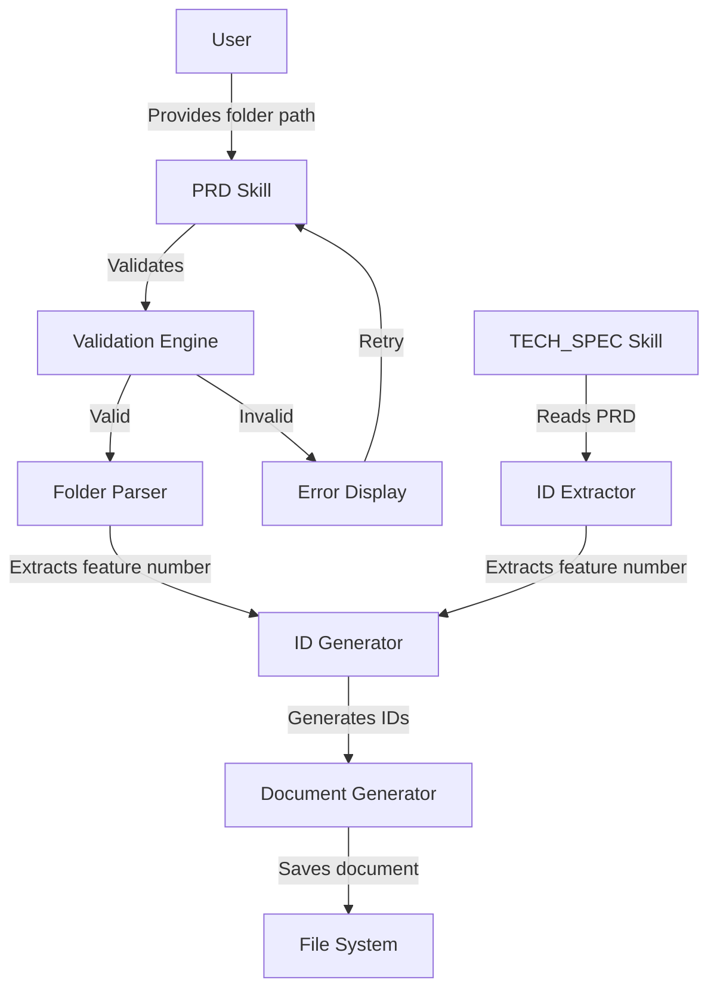
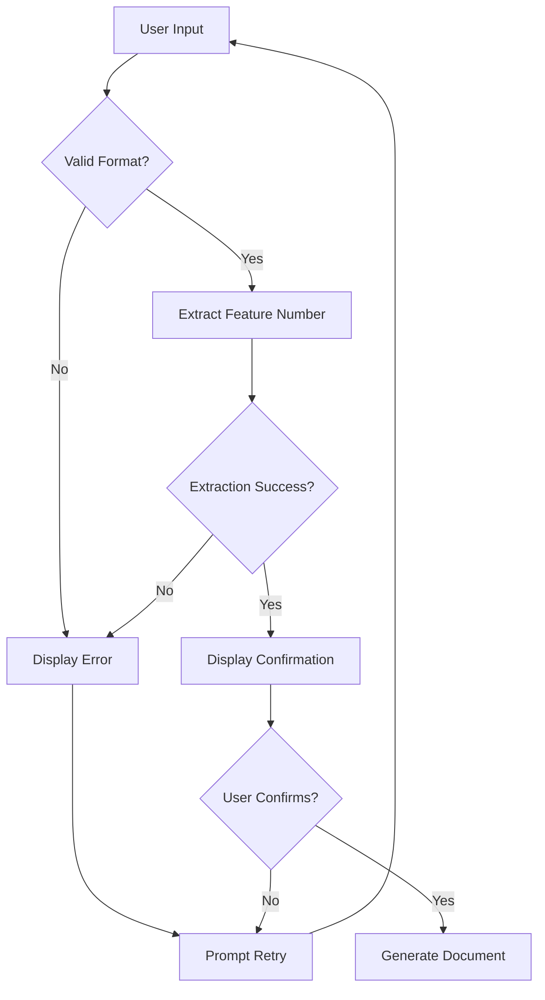

# Design Document: Folder-Based ID Generation

## Overview

This design document specifies the architecture and implementation approach for folder-based ID generation across four PRD generation skills (cc-gen-brd-prd, cc-gen-prd, cc-gen-prd-lite, cc-gen-tech-spec). The system extracts a 3-digit numeric prefix from folder names and uses it to generate consistent, traceable requirement IDs.

### Design Goals

1. **Consistency**: All requirement artifacts use the same feature number derived from the folder structure
2. **Traceability**: IDs are traceable back to the folder structure, making it easy to locate related documents
3. **Backward Compatibility**: Existing folder structures and file naming conventions remain unchanged
4. **Extensibility**: The design supports adding new ID types and skills in the future
5. **User-Friendly**: Clear prompts and error messages guide users through the process

### Key Design Decisions

- **Folder-First Approach**: The folder name is the single source of truth for the feature number
- **Validation-First**: Folder names are validated before any document generation begins
- **Global Sequential Numbering**: Acceptance criteria use global sequential numbering across all user stories within a feature
- **Round-Trip Support**: The TECH_SPEC skill can extract feature numbers from existing PRD IDs, enabling consistency across document types
- **Zero-Padding Preservation**: Leading zeros in feature numbers are preserved throughout the system (e.g., "006" not "6")


## Architecture

### High-Level Architecture

The system consists of three core components that work together to generate folder-based IDs:



### Component Responsibilities

1. **Validation Engine**: Validates folder name format before any processing
2. **Folder Parser**: Extracts the 3-digit feature number from validated folder names
3. **ID Generator**: Generates requirement IDs using the feature number and sequential counters
4. **ID Extractor**: Extracts feature numbers from existing requirement IDs (for TECH_SPEC skill)

### Data Flow

1. User provides folder path (e.g., "prd/006_about_founder_name/")
2. Validation Engine verifies format matches `{NNN}_{feature_name}`
3. Folder Parser extracts feature number "006"
4. System displays confirmation: "Using feature number 006 from folder '006_about_founder_name'"
5. User confirms
6. ID Generator creates IDs as needed (US-006-01, AC-006-01, etc.)
7. Document is generated with folder-based IDs
8. Document is saved to the specified folder


## Components and Interfaces

### 1. Validation Engine

**Purpose**: Validates folder name format before processing

**Interface**:
```typescript
interface ValidationEngine {
  validate(folderPath: string): ValidationResult;
  formatErrorMessage(folderPath: string, errors: ValidationError[]): string;
}

type ValidationResult = 
  | { valid: true }
  | { valid: false; errors: ValidationError[] };

type ValidationError = 
  | 'MISSING_PREFIX'
  | 'INVALID_PREFIX_LENGTH'
  | 'MISSING_UNDERSCORE'
  | 'PREFIX_OUT_OF_RANGE';
```

**Validation Rules**:
- Folder name must start with exactly 3 digits
- The 3 digits must be followed by an underscore
- The numeric prefix must be between 001 and 999 (inclusive)
- Pattern: `^(\d{3})_(.+)$`

**Error Message Format**:
```
Invalid folder name format

Expected pattern: {NNN}_{feature_name}
Example: 006_about_founder_name

Your input: {user_input}
Issue: {specific_issue}
```

### 2. Folder Parser

**Purpose**: Extracts the 3-digit feature number from validated folder names

**Interface**:
```typescript
interface FolderParser {
  extractFeatureNumber(folderPath: string): string;
}
```

**Implementation Details**:
- Uses regex pattern: `^(\d{3})_`
- Preserves leading zeros (e.g., "006" not "6")
- Returns the feature number as a string to maintain zero-padding
- Assumes input has already been validated

**Examples**:
- Input: "006_about_founder_name" → Output: "006"
- Input: "010_payment_gateway" → Output: "010"
- Input: "099_final_feature" → Output: "099"


### 3. ID Generator

**Purpose**: Generates requirement IDs using the feature number and sequential counters

**Interface**:
```typescript
interface IDGenerator {
  generateId(type: IDType, featureNumber: string, sequence: number): string;
  resetCounters(): void;
  getNextSequence(type: IDType): number;
}

type IDType = 
  | 'OBJ'      // Business Objective
  | 'GOAL'     // Goal
  | 'US'       // User Story
  | 'AC'       // Acceptance Criteria
  | 'RISK'     // Risk
  | 'NFR'      // Non-Functional Requirement
  | 'TC'       // Technical Constraint
  | 'FR'       // Functional Requirement
  | 'TEST';    // Test Case
```

**ID Format**: `{TYPE}-{feature_number}-{seq}`
- TYPE: One of the supported ID types
- feature_number: 3-digit feature number with leading zeros
- seq: 2-digit sequential number with zero-padding

**Sequential Numbering Strategy**:
- Most ID types use independent sequential counters (reset for each type)
- Acceptance Criteria (AC) use **global sequential numbering** across all user stories
- Counters reset when starting a new document generation

**Examples**:
- First user story: `US-006-01`
- Tenth acceptance criterion: `AC-006-10`
- First risk: `RISK-006-01`
- Fifth technical constraint: `TC-010-05`

### 4. ID Extractor

**Purpose**: Extracts feature numbers from existing requirement IDs (used by TECH_SPEC skill)

**Interface**:
```typescript
interface IDExtractor {
  extractFeatureNumber(requirementId: string): string | null;
  extractFromDocument(documentContent: string): ExtractionResult;
}

type ExtractionResult = 
  | { success: true; featureNumber: string }
  | { success: false; error: 'NO_IDS_FOUND' | 'INCONSISTENT_FEATURE_NUMBERS' };
```

**Implementation Details**:
- Uses regex pattern: `\w+-(\d{3})-\d+`
- Extracts feature number from any requirement ID format
- Validates consistency: all IDs in a document must have the same feature number
- Returns error if feature numbers are inconsistent

**Examples**:
- Input: "US-006-01" → Output: "006"
- Input: "AC-010-15" → Output: "010"
- Input: Multiple IDs with "006" → Output: "006"
- Input: IDs with "006" and "007" → Error: INCONSISTENT_FEATURE_NUMBERS


## Data Models

### Feature Context

Represents the extracted feature information used throughout document generation:

```typescript
interface FeatureContext {
  featureNumber: string;        // e.g., "006"
  folderName: string;            // e.g., "006_about_founder_name"
  folderPath: string;            // e.g., "prd/006_about_founder_name/"
  idGenerator: IDGenerator;      // Instance of ID generator with counters
}
```

### ID Generation State

Tracks sequential counters for each ID type:

```typescript
interface IDGenerationState {
  counters: Map<IDType, number>;
  globalACCounter: number;       // Special global counter for AC IDs
}
```

### Validation Error Details

Provides structured error information for user feedback:

```typescript
interface ValidationErrorDetails {
  errorType: ValidationError;
  userInput: string;
  expectedPattern: string;
  example: string;
  specificIssue: string;
}
```

### Document Metadata

Metadata stored in prd.json files:

```typescript
interface DocumentMetadata {
  featureId: string;             // The feature number (e.g., "006")
  featureName: string;           // Extracted from folder name
  documentType: 'BRD_PRD' | 'PRD' | 'TECH_SPEC';
  generatedDate: string;
  idFormat: 'folder-based';      // Indicates this document uses folder-based IDs
}
```


## Correctness Properties

*A property is a characteristic or behavior that should hold true across all valid executions of a system—essentially, a formal statement about what the system should do. Properties serve as the bridge between human-readable specifications and machine-verifiable correctness guarantees.*

### Property 1: Folder Prefix Extraction Preserves Leading Zeros

*For any* folder name matching the pattern `{NNN}_{feature_name}`, extracting the feature number should preserve all leading zeros in the 3-digit prefix.

**Validates: Requirements 1.1, 1.2**

### Property 2: Folder Validation Rejects Invalid Formats

*For any* folder name that does not match the pattern `^(\d{3})_(.+)$`, the validation engine should reject it and prevent document generation.

**Validates: Requirements 2.1, 2.2, 2.3**

### Property 3: Folder Prefix Range Validation

*For any* folder name with a numeric prefix, the validation engine should accept prefixes between 001 and 999 (inclusive) and reject prefixes outside this range (000, 1000+).

**Validates: Requirements 2.6**

### Property 4: Error Messages Contain Required Information

*For any* validation failure, the error message should contain the expected pattern, an example, the user's input, and a description of what is missing.

**Validates: Requirements 2.4, 2.5, 9.1, 9.2, 9.3, 9.4, 9.5**

### Property 5: ID Format Consistency

*For any* ID type, feature number, and sequence number, the generated ID should match the pattern `{TYPE}-{feature_number}-{seq}` where feature_number is 3 digits and seq is 2 digits with zero-padding.

**Validates: Requirements 3.1, 3.2**

### Property 6: All ID Types Supported

*For any* ID type in the set {OBJ, GOAL, US, AC, RISK, NFR, TC, FR}, the ID generator should be able to generate valid IDs using that type.

**Validates: Requirements 3.5, 5.1, 5.2, 5.3, 5.5, 5.6, 5.7, 5.8**


### Property 7: Global AC Sequential Numbering

*For any* sequence of acceptance criteria generated within a single feature, the AC IDs should use a global counter that increments across all user stories rather than resetting per user story.

**Validates: Requirements 3.6, 5.4, 6.2, 7.2**

### Property 8: Folder Path Validation Blocks Generation

*For any* invalid folder path, the system should not proceed with document generation until a valid folder path is provided.

**Validates: Requirements 4.3, 4.5, 6.5**

### Property 9: ID Extraction Round-Trip

*For any* requirement ID matching the pattern `\w+-(\d{3})-\d+`, extracting the feature number should return the 3-digit feature number with leading zeros preserved.

**Validates: Requirements 8.1, 12.1, 12.5**

### Property 10: Feature Number Consistency Check

*For any* document containing multiple requirement IDs, all IDs should have the same feature number, and the system should halt with an error if inconsistent feature numbers are detected.

**Validates: Requirements 12.3, 12.4**

### Property 11: File Path Generation Consistency

*For any* skill and folder name, the generated file path should follow the pattern `prds/{prefix}_{name}/{DOCUMENT_TYPE}.md` where DOCUMENT_TYPE is determined by the skill.

**Validates: Requirements 11.1, 11.2, 11.3, 11.4**

### Property 12: Folder Structure Preservation

*For any* document generation operation, the folder name and structure should remain unchanged after the operation completes.

**Validates: Requirements 11.5**

### Property 13: Confirmation Message Format

*For any* extracted feature number and folder name, the confirmation message should follow the format "Using feature number {feature_number} from folder '{folder_name}'".

**Validates: Requirements 10.2**

### Property 14: ID Reference Preservation

*For any* existing requirement ID referenced in a TECH_SPEC document, the ID should be copied without modification from the source PRD.

**Validates: Requirements 8.5**


## Error Handling

### Error Categories

1. **Validation Errors**: Folder name format violations
2. **Extraction Errors**: Unable to extract feature number from folder or IDs
3. **Consistency Errors**: Inconsistent feature numbers in existing documents
4. **File System Errors**: Unable to read or write files

### Error Handling Strategy

#### Validation Errors

**When**: Folder name doesn't match required pattern

**Response**:
1. Display formatted error message with:
   - Clear error title: "Invalid folder name format"
   - Expected pattern: `{NNN}_{feature_name}`
   - Example: "006_about_founder_name"
   - User's input
   - Specific issue (missing prefix, wrong length, missing underscore, etc.)
2. Allow user to retry with corrected input
3. Do not proceed with document generation

**Example Error Message**:
```
Invalid folder name format

Expected pattern: {NNN}_{feature_name}
Example: 006_about_founder_name

Your input: about_founder_name
Issue: Missing 3-digit numeric prefix at the start
```

#### Extraction Errors

**When**: Unable to extract feature number from folder name or existing IDs

**Response**:
1. Display error message explaining the issue
2. For folder extraction: prompt user for corrected folder path
3. For ID extraction: suggest checking the PRD format or providing folder path manually

#### Consistency Errors

**When**: TECH_SPEC skill finds multiple different feature numbers in a PRD

**Response**:
1. Display error message: "Inconsistent feature numbers detected in PRD"
2. List all detected feature numbers
3. Halt document generation
4. Suggest manual review of the PRD

**Example Error Message**:
```
Inconsistent feature numbers detected in PRD

Found feature numbers: 006, 007

All requirement IDs in a document must use the same feature number.
Please review the PRD and ensure all IDs are consistent.
```


#### File System Errors

**When**: Unable to read existing PRD or write generated document

**Response**:
1. Display error message with file path and system error
2. Suggest checking file permissions
3. For read errors: allow user to provide folder path manually
4. For write errors: suggest alternative folder path

### Error Recovery Flows



### Graceful Degradation

If the TECH_SPEC skill cannot extract feature numbers from an existing PRD:
1. Fall back to prompting user for folder path
2. Validate the provided folder path
3. Use the extracted feature number for TECH_SPEC generation
4. Log a warning about the fallback behavior


## Testing Strategy

### Dual Testing Approach

This feature requires both unit tests and property-based tests to ensure comprehensive coverage:

- **Unit tests**: Verify specific examples, edge cases, and error conditions
- **Property tests**: Verify universal properties across all inputs

### Unit Testing Focus

Unit tests should cover:

1. **Specific Examples**:
   - Folder name "006_about_founder_name" → Feature number "006"
   - Folder name "010_payment_gateway" → Feature number "010"
   - ID generation: US-006-01, AC-006-10, etc.

2. **Edge Cases**:
   - Minimum valid prefix: "001"
   - Maximum valid prefix: "999"
   - Invalid prefix: "000", "1000"
   - Missing underscore: "006about"
   - Wrong prefix length: "06_feature", "0006_feature"

3. **Error Conditions**:
   - Invalid folder format error messages
   - Inconsistent feature numbers in PRD
   - File system errors

4. **Integration Points**:
   - User prompt flow
   - Confirmation message display
   - Document generation with folder-based IDs

### Property-Based Testing Focus

Property tests should verify universal behaviors across randomized inputs. Each property test must:
- Run minimum 100 iterations
- Reference the design document property
- Use tag format: **Feature: folder-based-id-generation, Property {number}: {property_text}**

**Property Test Library**: Use `fast-check` for TypeScript/JavaScript implementation


**Property Tests to Implement**:

1. **Property 1: Folder Prefix Extraction Preserves Leading Zeros**
   - Generate random 3-digit prefixes (001-999)
   - Generate random feature names
   - Verify extraction preserves leading zeros

2. **Property 2: Folder Validation Rejects Invalid Formats**
   - Generate random invalid folder names
   - Verify all are rejected

3. **Property 3: Folder Prefix Range Validation**
   - Generate prefixes at boundaries (000, 001, 999, 1000)
   - Verify correct acceptance/rejection

4. **Property 4: Error Messages Contain Required Information**
   - Generate random invalid inputs
   - Verify error messages contain all required elements

5. **Property 5: ID Format Consistency**
   - Generate random ID types, feature numbers, sequences
   - Verify all match the expected pattern

6. **Property 6: All ID Types Supported**
   - Test each ID type with random feature numbers and sequences
   - Verify all generate valid IDs

7. **Property 7: Global AC Sequential Numbering**
   - Generate multiple user stories with acceptance criteria
   - Verify AC counter increments globally

8. **Property 9: ID Extraction Round-Trip**
   - Generate random requirement IDs
   - Verify extraction returns correct feature number

9. **Property 10: Feature Number Consistency Check**
   - Generate documents with consistent and inconsistent IDs
   - Verify consistency validation works correctly

10. **Property 11: File Path Generation Consistency**
    - Generate random folder names and skills
    - Verify file paths match expected pattern

### Test Coverage Goals

- Minimum 80% code coverage for core components
- 100% coverage for validation logic
- 100% coverage for ID generation logic
- All error paths must be tested


## Integration Approach

### Overview

Each of the four PRD generation skills will be updated to use the folder-based ID generation system. The integration follows a consistent pattern across all skills with skill-specific variations.

### Common Integration Pattern

All skills follow this sequence:

1. **Prompt for Folder Path**
   - Display: "Where should this document be saved? (e.g., prd/006_about_founder_name/)"
   - Capture user input

2. **Validate Folder Path**
   - Use Validation Engine to check format
   - Display error and retry if invalid

3. **Extract Feature Number**
   - Use Folder Parser to extract 3-digit prefix
   - Create FeatureContext object

4. **Display Confirmation**
   - Show: "Using feature number {feature_number} from folder '{folder_name}'"
   - Wait for user confirmation

5. **Generate Document**
   - Use ID Generator for all requirement IDs
   - Maintain sequential counters per ID type
   - Use global counter for AC IDs

6. **Save Document**
   - Save to `prds/{prefix}_{name}/{DOCUMENT_TYPE}.md`
   - Generate metadata file if applicable


### Skill-Specific Integration

#### 1. cc-gen-brd-prd Skill

**Document Type**: BRD_PRD.md (combined Business Requirements and Product Requirements)

**ID Types Used**:
- OBJ: Business Objectives
- GOAL: Goals
- US: User Stories
- AC: Acceptance Criteria (global sequential)
- RISK: Risks
- NFR: Non-Functional Requirements
- TC: Technical Constraints
- FR: Functional Requirements

**Integration Points**:
1. Add folder path prompt at skill initialization
2. Initialize ID Generator with all 8 ID types
3. Update Business Objectives section to use OBJ-{feature_number}-{seq}
4. Update Goals section to use GOAL-{feature_number}-{seq}
5. Update User Stories section to use US-{feature_number}-{seq}
6. Update Acceptance Criteria to use AC-{feature_number}-{seq} with global counter
7. Update Risks section to use RISK-{feature_number}-{seq}
8. Update NFRs section to use NFR-{feature_number}-{seq}
9. Update Technical Constraints to use TC-{feature_number}-{seq}
10. Update Functional Requirements to use FR-{feature_number}-{seq}
11. Set featureId field in JSON metadata to feature_number

**Example Output**:
```markdown
## Business Objectives

### OBJ-006-01: Increase User Engagement
...

## User Stories

### US-006-01: User Login
As a user, I want to log in...

#### Acceptance Criteria
- AC-006-01: WHEN user enters valid credentials...
- AC-006-02: WHEN user enters invalid credentials...

### US-006-02: User Profile
As a user, I want to view my profile...

#### Acceptance Criteria
- AC-006-03: WHEN user navigates to profile... (note: global counter continues)
```


#### 2. cc-gen-prd Skill

**Document Type**: PRD.md (Product Requirements Document)

**ID Types Used**:
- US: User Stories
- AC: Acceptance Criteria (global sequential)
- FR: Functional Requirements

**Integration Points**:
1. Add folder path prompt at skill initialization
2. Initialize ID Generator with US, AC, FR types
3. Update User Stories section to use US-{feature_number}-{seq}
4. Update Acceptance Criteria to use AC-{feature_number}-{seq} with global counter
5. Update Functional Requirements to use FR-{feature_number}-{seq}

**Example Output**:
```markdown
## User Stories

### US-010-01: Payment Processing
As a customer, I want to process payments...

#### Acceptance Criteria
- AC-010-01: WHEN customer enters card details...
- AC-010-02: WHEN payment is successful...

## Functional Requirements

### FR-010-01: Payment Gateway Integration
The system shall integrate with Stripe...
```

#### 3. cc-gen-prd-lite Skill

**Document Type**: PRD.md (Streamlined Product Requirements Document)

**ID Types Used**:
- US: User Stories
- AC: Acceptance Criteria (global sequential)
- FR: Functional Requirements
- NFR: Non-Functional Requirements

**Integration Points**:
1. Add folder path prompt at skill initialization
2. Initialize ID Generator with US, AC, FR, NFR types
3. Update Overview section to set Feature ID field to feature_number
4. Update User Stories section to use US-{feature_number}-{seq}
5. Update Acceptance Criteria to use AC-{feature_number}-{seq} with global counter
6. Update Functional Requirements to use FR-{feature_number}-{seq}
7. Update Non-Functional Requirements to use NFR-{feature_number}-{seq}

**Example Output**:
```markdown
## Overview

**Feature ID**: 099
**Feature Name**: Final Feature

## User Stories

### US-099-01: Feature Implementation
...

## Non-Functional Requirements

### NFR-099-01: Performance
The system shall respond within 200ms...
```


#### 4. cc-gen-tech-spec Skill

**Document Type**: TECH_SPEC.md (Technical Design Specification)

**ID Types Used**:
- TC: Technical Constraints
- TEST: Test Cases
- References to US, AC from PRD (not generated, just referenced)

**Integration Points**:
1. Check if PRD exists in the same folder
2. If PRD exists:
   - Use ID Extractor to extract feature_number from existing IDs
   - Validate all IDs have consistent feature_number
   - If inconsistent, display error and halt
3. If PRD does not exist:
   - Prompt user for folder path
   - Validate and extract feature_number
4. Initialize ID Generator with TC and TEST types
5. Update Technical Constraints section to use TC-{feature_number}-{seq}
6. Update Test Cases section to use TEST-{feature_number}-{seq}
7. Reference existing US and AC IDs from PRD without modification

**Example Output**:
```markdown
## Technical Constraints

### TC-006-01: Database Performance
The system must support 1000 concurrent users...

## Test Cases

### TEST-006-01: User Login Flow
**Related Requirements**: US-006-01, AC-006-01, AC-006-02

**Test Steps**:
1. Navigate to login page
2. Enter valid credentials
3. Click login button

**Expected Result**: User is logged in and redirected to dashboard
```

**Special Handling for Round-Trip Extraction**:

```typescript
// Pseudocode for TECH_SPEC skill integration
async function generateTDS(folderPath?: string) {
  let featureNumber: string;
  
  // Try to extract from existing PRD
  const prdPath = `${folderPath}/PRD.md`;
  if (fileExists(prdPath)) {
    const prdContent = readFile(prdPath);
    const extractionResult = idExtractor.extractFromDocument(prdContent);
    
    if (extractionResult.success) {
      featureNumber = extractionResult.featureNumber;
      console.log(`Extracted feature number ${featureNumber} from existing PRD`);
    } else if (extractionResult.error === 'INCONSISTENT_FEATURE_NUMBERS') {
      throw new Error('Inconsistent feature numbers detected in PRD');
    } else {
      // Fall back to prompting user
      featureNumber = await promptForFolderPath();
    }
  } else {
    // No PRD exists, prompt user
    featureNumber = await promptForFolderPath();
  }
  
  // Generate TECH_SPEC with extracted feature number
  const idGenerator = new IDGenerator(featureNumber);
  // ... continue with document generation
}
```


## Implementation Examples

### Example 1: Complete Flow for cc-gen-prd

**User Input**: `prd/006_about_founder_name/`

**System Flow**:

1. **Validation**:
```
Input: "prd/006_about_founder_name/"
Regex: ^(\d{3})_
Match: "006_"
Valid: ✓
```

2. **Extraction**:
```
Folder name: "006_about_founder_name"
Feature number: "006"
```

3. **Confirmation**:
```
Using feature number 006 from folder '006_about_founder_name'
```

4. **ID Generation**:
```
User Story 1: US-006-01
  AC 1: AC-006-01
  AC 2: AC-006-02
User Story 2: US-006-02
  AC 3: AC-006-03  (global counter continues)
  AC 4: AC-006-04
Functional Req 1: FR-006-01
```

5. **File Output**:
```
prd/006_about_founder_name/PRD.md
```

### Example 2: Error Handling

**User Input**: `prd/about_founder_name/`

**System Response**:
```
Invalid folder name format

Expected pattern: {NNN}_{feature_name}
Example: 006_about_founder_name

Your input: about_founder_name
Issue: Missing 3-digit numeric prefix at the start

Please provide a valid folder path:
```

**User Retry**: `prd/006_about_founder_name/`

**System Response**:
```
Using feature number 006 from folder '006_about_founder_name'

Proceed with document generation? (yes/no)
```


### Example 3: TECH_SPEC Round-Trip Extraction

**Existing PRD Content** (prd/010_payment_gateway/PRD.md):
```markdown
## User Stories

### US-010-01: Process Payment
...

#### Acceptance Criteria
- AC-010-01: WHEN customer enters card...
- AC-010-02: WHEN payment succeeds...

### US-010-02: Refund Payment
...

#### Acceptance Criteria
- AC-010-03: WHEN refund is requested...
```

**TECH_SPEC Generation Flow**:

1. **Read PRD**:
```
Found PRD at: prd/010_payment_gateway/PRD.md
```

2. **Extract IDs**:
```
Found IDs: US-010-01, AC-010-01, AC-010-02, US-010-02, AC-010-03
Extracted feature numbers: 010, 010, 010, 010, 010
Consistent: ✓
Feature number: 010
```

3. **Generate TECH_SPEC**:
```
Technical Constraint 1: TC-010-01
Test Case 1: TEST-010-01 (references US-010-01, AC-010-01)
Test Case 2: TEST-010-02 (references US-010-02, AC-010-03)
```

4. **File Output**:
```
prd/010_payment_gateway/TECH_SPEC.md
```

### Example 4: Inconsistent Feature Numbers Error

**Existing PRD Content** (corrupted):
```markdown
### US-006-01: Feature A
### US-007-01: Feature B
```

**TECH_SPEC Generation Flow**:

1. **Read PRD**:
```
Found PRD at: prd/006_feature/PRD.md
```

2. **Extract IDs**:
```
Found IDs: US-006-01, US-007-01
Extracted feature numbers: 006, 007
Consistent: ✗
```

3. **Error Display**:
```
Inconsistent feature numbers detected in PRD

Found feature numbers: 006, 007

All requirement IDs in a document must use the same feature number.
Please review the PRD and ensure all IDs are consistent.
```


## Implementation Considerations

### Technology Stack

**Language**: TypeScript (for Kiro skill implementation)

**Key Libraries**:
- No external dependencies required for core functionality
- Built-in RegExp for pattern matching
- Standard string manipulation functions

**Testing Libraries**:
- `fast-check`: Property-based testing
- `vitest`: Unit testing framework
- `@testing-library/react`: If UI components are involved

### Code Organization

```
src/
├── lib/
│   ├── folder-based-id/
│   │   ├── validation-engine.ts
│   │   ├── folder-parser.ts
│   │   ├── id-generator.ts
│   │   ├── id-extractor.ts
│   │   ├── types.ts
│   │   └── index.ts
│   └── skills/
│       ├── cc-gen-brd-prd/
│       │   └── skill.ts (updated)
│       ├── cc-gen-prd/
│       │   └── skill.ts (updated)
│       ├── cc-gen-prd-lite/
│       │   └── skill.ts (updated)
│       └── cc-gen-tech-spec/
│           └── skill.ts (updated)
└── tests/
    ├── unit/
    │   └── folder-based-id/
    │       ├── validation-engine.test.ts
    │       ├── folder-parser.test.ts
    │       ├── id-generator.test.ts
    │       └── id-extractor.test.ts
    └── property/
        └── folder-based-id/
            ├── validation.property.test.ts
            ├── id-generation.property.test.ts
            └── extraction.property.test.ts
```

### Performance Considerations

1. **Regex Compilation**: Compile regex patterns once and reuse
2. **ID Generation**: Use efficient counter management (Map-based)
3. **File Reading**: Cache PRD content when extracting IDs for TECH_SPEC
4. **Validation**: Fail fast on first validation error

### Security Considerations

1. **Path Traversal**: Validate folder paths to prevent directory traversal attacks
2. **Input Sanitization**: Sanitize user input before displaying in error messages
3. **File System Access**: Restrict file operations to designated PRD directories


### Migration Strategy

#### Phase 1: Core Components (Week 1)
1. Implement Validation Engine
2. Implement Folder Parser
3. Implement ID Generator
4. Implement ID Extractor
5. Write unit tests for all components
6. Write property tests for all components

#### Phase 2: Skill Integration (Week 2)
1. Update cc-gen-brd-prd skill
2. Update cc-gen-prd skill
3. Update cc-gen-prd-lite skill
4. Update cc-gen-tech-spec skill
5. Test each skill independently

#### Phase 3: Integration Testing (Week 3)
1. Test complete flow for each skill
2. Test error handling and recovery
3. Test TECH_SPEC round-trip extraction
4. Test edge cases and boundary conditions

#### Phase 4: Documentation and Rollout (Week 4)
1. Update skill documentation
2. Create user guide with examples
3. Announce feature to users
4. Monitor for issues and gather feedback

### Backward Compatibility

**Existing Documents**: Documents generated before this feature will continue to work. The system does not modify existing documents.

**Mixed Environments**: Users can have both old-style and new-style documents in the same repository. The TECH_SPEC skill will detect which format is used and adapt accordingly.

**Migration Path**: Users can gradually migrate to folder-based IDs by:
1. Creating new folders with the `{NNN}_{feature_name}` pattern
2. Generating new documents with folder-based IDs
3. Optionally regenerating old documents with new folder structure


## Appendix A: ID Type Reference

| ID Type | Full Name                    | Used By Skills                  | Description                           |
|---------|------------------------------|---------------------------------|---------------------------------------|
| OBJ     | Business Objective           | cc-gen-brd-prd                  | High-level business goals             |
| GOAL    | Goal                         | cc-gen-brd-prd                  | Specific measurable goals             |
| US      | User Story                   | All skills                      | User-facing feature descriptions      |
| AC      | Acceptance Criteria          | All skills (except TECH_SPEC)         | Testable conditions for user stories  |
| RISK    | Risk                         | cc-gen-brd-prd                  | Identified project risks              |
| NFR     | Non-Functional Requirement   | cc-gen-brd-prd, cc-gen-prd-lite | Performance, security, etc.           |
| TC      | Technical Constraint         | cc-gen-brd-prd, cc-gen-tech-spec      | Technical limitations or requirements |
| FR      | Functional Requirement       | cc-gen-brd-prd, cc-gen-prd, cc-gen-prd-lite | Detailed functional specifications |
| TEST    | Test Case                    | cc-gen-tech-spec                      | Test scenarios and expected results   |

## Appendix B: Regex Patterns

### Folder Name Validation
```regex
^(\d{3})_(.+)$
```
- `^` - Start of string
- `(\d{3})` - Exactly 3 digits (captured as group 1)
- `_` - Underscore separator
- `(.+)` - One or more characters for feature name (captured as group 2)
- `$` - End of string

### Folder Prefix Extraction
```regex
^(\d{3})_
```
- `^` - Start of string
- `(\d{3})` - Exactly 3 digits (captured as group 1)
- `_` - Underscore separator

### ID Feature Number Extraction
```regex
\w+-(\d{3})-\d+
```
- `\w+` - One or more word characters (ID type)
- `-` - Hyphen separator
- `(\d{3})` - Exactly 3 digits (captured as group 1 - feature number)
- `-` - Hyphen separator
- `\d+` - One or more digits (sequence number)


## Appendix C: Sample Code Snippets

### Validation Engine Implementation

```typescript
class ValidationEngine {
  private readonly PATTERN = /^(\d{3})_(.+)$/;
  private readonly MIN_PREFIX = 1;
  private readonly MAX_PREFIX = 999;

  validate(folderPath: string): ValidationResult {
    const folderName = this.extractFolderName(folderPath);
    const match = folderName.match(this.PATTERN);

    if (!match) {
      return {
        valid: false,
        errors: this.identifyErrors(folderName)
      };
    }

    const prefix = parseInt(match[1], 10);
    if (prefix < this.MIN_PREFIX || prefix > this.MAX_PREFIX) {
      return {
        valid: false,
        errors: ['PREFIX_OUT_OF_RANGE']
      };
    }

    return { valid: true };
  }

  private extractFolderName(folderPath: string): string {
    // Remove trailing slash and extract last segment
    const normalized = folderPath.replace(/\/$/, '');
    const segments = normalized.split('/');
    return segments[segments.length - 1];
  }

  private identifyErrors(folderName: string): ValidationError[] {
    const errors: ValidationError[] = [];
    
    if (!/^\d/.test(folderName)) {
      errors.push('MISSING_PREFIX');
    } else if (!/^\d{3}/.test(folderName)) {
      errors.push('INVALID_PREFIX_LENGTH');
    } else if (!/^\d{3}_/.test(folderName)) {
      errors.push('MISSING_UNDERSCORE');
    }
    
    return errors;
  }

  formatErrorMessage(folderPath: string, errors: ValidationError[]): string {
    const folderName = this.extractFolderName(folderPath);
    const issueDescriptions = {
      'MISSING_PREFIX': 'Missing 3-digit numeric prefix at the start',
      'INVALID_PREFIX_LENGTH': 'Prefix must be exactly 3 digits',
      'MISSING_UNDERSCORE': 'Missing underscore after the 3-digit prefix',
      'PREFIX_OUT_OF_RANGE': 'Prefix must be between 001 and 999'
    };

    const issues = errors.map(e => issueDescriptions[e]).join(', ');

    return `Invalid folder name format

Expected pattern: {NNN}_{feature_name}
Example: 006_about_founder_name

Your input: ${folderName}
Issue: ${issues}`;
  }
}
```


### Folder Parser Implementation

```typescript
class FolderParser {
  private readonly PATTERN = /^(\d{3})_/;

  extractFeatureNumber(folderPath: string): string {
    const folderName = this.extractFolderName(folderPath);
    const match = folderName.match(this.PATTERN);
    
    if (!match) {
      throw new Error('Invalid folder format. Validation should be performed first.');
    }
    
    return match[1]; // Returns the 3-digit prefix with leading zeros
  }

  private extractFolderName(folderPath: string): string {
    const normalized = folderPath.replace(/\/$/, '');
    const segments = normalized.split('/');
    return segments[segments.length - 1];
  }
}
```

### ID Generator Implementation

```typescript
class IDGenerator {
  private counters: Map<IDType, number> = new Map();
  private globalACCounter: number = 0;

  constructor(private featureNumber: string) {
    this.resetCounters();
  }

  generateId(type: IDType, sequence?: number): string {
    const seq = sequence ?? this.getNextSequence(type);
    const paddedSeq = seq.toString().padStart(2, '0');
    return `${type}-${this.featureNumber}-${paddedSeq}`;
  }

  getNextSequence(type: IDType): number {
    if (type === 'AC') {
      return ++this.globalACCounter;
    }
    
    const current = this.counters.get(type) ?? 0;
    const next = current + 1;
    this.counters.set(type, next);
    return next;
  }

  resetCounters(): void {
    this.counters.clear();
    this.globalACCounter = 0;
    
    // Initialize all ID types
    const types: IDType[] = ['OBJ', 'GOAL', 'US', 'AC', 'RISK', 'NFR', 'TC', 'FR', 'TEST'];
    types.forEach(type => this.counters.set(type, 0));
  }
}
```


### ID Extractor Implementation

```typescript
class IDExtractor {
  private readonly PATTERN = /\w+-(\d{3})-\d+/g;

  extractFeatureNumber(requirementId: string): string | null {
    const match = requirementId.match(/\w+-(\d{3})-\d+/);
    return match ? match[1] : null;
  }

  extractFromDocument(documentContent: string): ExtractionResult {
    const matches = documentContent.matchAll(this.PATTERN);
    const featureNumbers = new Set<string>();

    for (const match of matches) {
      featureNumbers.add(match[1]);
    }

    if (featureNumbers.size === 0) {
      return {
        success: false,
        error: 'NO_IDS_FOUND'
      };
    }

    if (featureNumbers.size > 1) {
      return {
        success: false,
        error: 'INCONSISTENT_FEATURE_NUMBERS'
      };
    }

    return {
      success: true,
      featureNumber: Array.from(featureNumbers)[0]
    };
  }
}
```

## Appendix D: User Interaction Flows

### Flow 1: Successful Document Generation

```
User: Generate PRD
System: Where should this document be saved? (e.g., prd/006_about_founder_name/)
User: prd/006_about_founder_name/
System: Using feature number 006 from folder '006_about_founder_name'
System: Proceed with document generation? (yes/no)
User: yes
System: [Generates document with IDs: US-006-01, AC-006-01, etc.]
System: Document saved to prd/006_about_founder_name/PRD.md
```

### Flow 2: Error and Retry

```
User: Generate PRD
System: Where should this document be saved? (e.g., prd/006_about_founder_name/)
User: prd/about_founder/
System: Invalid folder name format
        Expected pattern: {NNN}_{feature_name}
        Example: 006_about_founder_name
        Your input: about_founder
        Issue: Missing 3-digit numeric prefix at the start
System: Please provide a valid folder path:
User: prd/006_about_founder/
System: Using feature number 006 from folder '006_about_founder'
System: Proceed with document generation? (yes/no)
User: yes
System: [Generates document]
```

### Flow 3: TECH_SPEC with Existing PRD

```
User: Generate TECH_SPEC
System: Found existing PRD at prd/010_payment_gateway/PRD.md
System: Extracted feature number 010 from PRD
System: Using feature number 010 for TECH_SPEC generation
System: Proceed with document generation? (yes/no)
User: yes
System: [Generates TECH_SPEC with IDs: TC-010-01, TEST-010-01, etc.]
System: Document saved to prd/010_payment_gateway/TECH_SPEC.md
```


## Summary

This design document specifies a comprehensive folder-based ID generation system for PRD generation skills. The system provides:

1. **Consistent ID Generation**: All requirement artifacts use feature numbers derived from folder structure
2. **Robust Validation**: Folder names are validated before processing with clear error messages
3. **Round-Trip Support**: TECH_SPEC skill can extract feature numbers from existing PRDs
4. **Extensibility**: Easy to add new ID types and skills
5. **User-Friendly**: Clear prompts, confirmations, and error messages guide users

The implementation follows a modular architecture with four core components (Validation Engine, Folder Parser, ID Generator, ID Extractor) that integrate seamlessly with existing PRD generation skills. The design establishes a single canonical contract for generated requirement IDs.

Property-based testing ensures correctness across all possible inputs, while unit tests cover specific examples and edge cases. The dual testing approach provides comprehensive coverage and confidence in the system's reliability.

---

**Document Version**: 1.0  
**Last Updated**: 2024  
**Status**: Ready for Implementation
