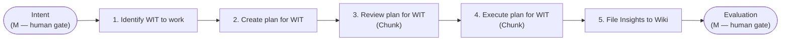

# AI-Assisted Development Workflow

A reusable, end-to-end process reference for shipping work on **casacolinacare.com** with AI doing the execution and humans gating the boundaries. The workflow reads left to right as a value stream from **Intent** (where work originates) to **Evaluation** (where the result is assessed).

> **Source of truth:** `kriss-title-change.excalidraw` (Excalidraw v2), read as a left-to-right value stream from Intent to Evaluation. This document describes the *reusable workflow*. The two example work items and the embedded "Meet Our Team" screenshot are illustrative payloads, not the subject — see the [Examples appendix](#examples-illustrative-only).
>
> **Fidelity note:** This spec deliberately reflects only what the canvas spatially encodes. The diagram places the five pipeline stages, the five lane headers, the M/AI tags, and the systems in four *separate* clusters with no connecting arrows between them. It therefore does **not** bind specific stages to specific lanes, to specific M/AI modes, or to specific systems. Those bindings are intentionally left unstated below rather than invented.

---

## Operating Principle: Human-Gated, AI-Executed

The defining property of this workflow is its gating model: **humans bookend the flow, AI executes the middle.**

On the canvas, `M` (Manual / human) and `AI` tags appear in a single horizontal row across the lane band: `M` at the far-left start, `AI` repeated across the middle, and `M` again at the far-right end. The coarse, supported reading is:

- **Front gate — `M` (human):** Define intent and identify the Work Item (WIT) to work. A human decides *what* and *why*.
- **Middle — `AI`:** The work moves through the AI-executed middle lanes — planning, plan review, execution, QA, validation, and filing insights.
- **Back gate — `M` (human):** Final **Evaluation** / approval. A human decides *whether the result is acceptable*.

> **Critical distinction — Validation lane vs. Evaluation gate.** The **Validation** lane sits *inside* the AI-tagged middle band; an `AI` tag is positioned over it. The human bookend is the **Evaluation** end-label that *follows* the lanes at the far right. Do not read the whole Validation lane as manual — only the final Evaluation approval is the human back gate.

> The M/AI tags are **not** mapped one-to-one onto lanes (there are six tags spanning five lanes) and are **not** connected to the stage column. They support only the bookend claim above, not a per-stage or per-lane mode assignment.



**WIT** = Work Item (Azure DevOps / ADO terminology).

---

## The Four Diagram Clusters

The canvas is composed of four spatially distinct clusters. They are presented here as the diagram presents them — separately, without cross-binding.

### 1. Work-Item Pipeline (ordered stages)

The work-item lifecycle, read top-to-bottom in the left-hand stage column, in order:

1. **Identify WIT to work**
2. **Create plan for WIT**
3. **Review plan for WIT** — annotated **"Chunk"**
4. **Execute plan for WIT** — annotated **"Chunk"**
5. **File Insights to wiki**

> The **"Chunk"** annotations sit beside stages 3 and 4 specifically. Both Review and Execute are performed in discrete increments, not in a single monolithic pass.

#### Closing activity cluster (near the Execute / PR step)

A single block on the canvas lists five closing activities, verbatim:

- Push branch, open PR
- Update WIT
- File follow up
- QA handoff
- Worktree clean up

> This is exactly five activities, listed as one undivided block. The canvas assigns them no per-item lane, mode, or system.

### 2. Swimlane Roles (names only)

Five role lanes span the value stream left to right. The diagram provides lane **names only** — no responsibility descriptions are attached to them on the canvas.

- PO/PM
- Dev
- QA
- DevOps
- Validation

### 3. Manual / AI Tagging

A single coarse claim, as encoded by the tag row over the lane band:

> **`M` at the start, `AI` across the middle lanes, `M` at the far end.**

Humans bookend the flow (define intent + final validation/approval); AI executes the middle. This is human-gated, AI-executed. No finer-grained mode assignment is supported by the canvas.

### 4. Systems and Tools

**Systems** (drawn as a separate cluster; the canvas does not arrow-wire them to specific steps):

- **ADO (Azure DevOps)**
- **GitHub**
- **Wiki (Backlog)**

**Tools** (on-canvas working inventory; not bound to any specific stage):

- Chrome DevTools
- Chrome Browser
- Azure DevOps
- Git
- TypeScript LSP
- Graphify

---

## Runbook: Per-Work-Item Steps

A do-this-then-that checklist for **one WIT**. The canvas does not bind stages to lanes, modes, or systems, so those columns are omitted. The only step that names a system in its own text is **File Insights to wiki**; that single mapping is retained. All other step→system associations are intentionally absent.

| #   | Step                                    | System (named in step text only) |
| --- | --------------------------------------- | -------------------------------- |
| 0   | **Intent** — work originates            | —                                |
| 1   | **Identify WIT to work**                | —                                |
| 2   | **Create plan for WIT**                 | —                                |
| 3   | **Review plan for WIT** *(Chunk)*       | —                                |
| 4   | **Execute plan for WIT** *(Chunk)*      | —                                |
| —   | *Closing cluster* (run at step 4)       | —                                |
| 5   | **File Insights to wiki**               | Wiki (Backlog)                   |
| 6   | **Evaluation** — human assesses result  | —                                |

### Closing cluster (verbatim, run at step 4)

- [ ] Push branch, open PR
- [ ] Update WIT
- [ ] File follow up
- [ ] QA handoff
- [ ] Worktree clean up

### End-to-end checklist (single pass)

```text
[ ] Intent defined                       (M — human front gate)
[ ] 1. Identify WIT to work
[ ] 2. Create plan for WIT
[ ] 3. Review plan for WIT   (Chunk)
[ ] 4. Execute plan for WIT  (Chunk)
        Closing cluster:
        [ ] Push branch, open PR
        [ ] Update WIT
        [ ] File follow up
        [ ] QA handoff
        [ ] Worktree clean up
[ ] 5. File Insights to wiki                          -> Wiki (Backlog)
[ ] Evaluation / approval                (M — human back gate)
```

> The middle of the flow runs in `AI` mode; the front (Intent / Identify) and back (Evaluation) are the human `M` gates.

---

## Examples (Illustrative Only)

The source canvas carries two example work items and one screenshot to show payloads moving through the pipeline above. They illustrate the workflow; they are **not** its subject.

### Example WIT (a) — "Req: Add Kriss Photo"

Carries a meta-prompt as its payload, entering at Intent:

```markdown
# Meta-Prompt to add kriss photo in the about page
## Goal — On the about page, add Kriss photo; the photo is in images/kriss.jpg
## Role — You are a developer/qa for casacolinacare.com
## Rules — Use webp images when adding photo
```

### Example WIT (b) — "Change Kriss's title to 'Founder & CEO'"

A second illustrative WIT, phrased as a desired end state, flowing through the same Identify → Create plan → Review → Execute → File Insights pipeline.

### Reference Screenshot — About Page "Meet Our Team" (current state)

Embedded on the canvas to show the live starting state these examples act against:

- **Mari Kriss C. Aseniero — Founder & Director**
- **Care Team Member — Lead Caregiver**
- **Care Team Member — Activities Coordinator**
- Photos are placeholder (empty).

This screenshot documents the *before* condition the illustrative WITs would act on; it is reference context, not a workflow stage.

> **Verifiability caveat.** Of the five image elements on the canvas, only this "Meet Our Team" screenshot has its image data embedded in the archive and is therefore content-verifiable. Four other image elements are referenced by the canvas — including one positioned near the **Evaluation** end-label — but their image data is not embedded, so no content claims are made about them here.
