# **Taskfile.yml for Docker Management - Technical Design Document**

---

|  |  |
| :---- | :---- |
| **Author(s)** | AI System Architect |
| **Reviewer(s)** | Jairo (Product Owner), Development Team Lead |
| **Status** | Draft |
| **Last Updated** | 2025-10-07 |
| **Related Documents** | [BRD/PRD](./prd.md), [Requirements](./req.md) |
| **Version** | 1.0 |

---

## **1. Introduction**

### **1.1 Background & Problem Statement**

The Next.js 15 starter project currently requires developers to manually execute verbose Docker and Docker Compose commands for common operations such as building images, starting containers, viewing logs, and cleaning up resources. This manual approach creates several problems:

1. **Cognitive Overhead**: Developers must remember complex command syntax, flags, and options for various Docker operations
2. **Error-Prone**: Manual typing of long commands increases the likelihood of typos and incorrect flag usage
3. **Inconsistency**: Different developers may use different approaches or flags for the same operation
4. **Lack of Documentation**: No centralized reference for common Docker operations specific to this project
5. **Time Waste**: Repeatedly typing the same lengthy commands reduces productivity

The existing `docker-compose.yml` and multi-stage `Dockerfile` are well-configured for the project, but there is no standardized task runner interface to simplify their usage. This technical design addresses this gap by implementing a Taskfile.yml-based solution that provides a simple, consistent, and well-documented interface for all common Docker operations.

### **1.2 User Stories**

Based on the BRD/PRD, the key user stories this technical implementation addresses are:

* **As a developer**, I want to build Docker images using simple task commands so that I don't have to remember complex Docker build flags and options.
* **As a developer**, I want to start and stop Docker containers easily so that I can quickly test the application in a containerized environment.
* **As a developer**, I want comprehensive cleanup tasks so that I can easily remove all Docker resources and free up disk space.
* **As a developer**, I want to see available tasks and their descriptions so that I can discover and understand what operations are available.
* **As a developer**, I want comprehensive instructions in the README so that I can quickly learn how to use the Taskfile without reading the entire Taskfile.yml.

### **1.3 Goals & Non-Goals**

**Goals:**

1. Create a complete Taskfile.yml that wraps all common Docker operations for this Next.js 15 project
2. Provide task organization using the `docker:` namespace prefix convention
3. Implement comprehensive cleanup tasks including `docker:clean:all` for deep system cleaning
4. Include clear `desc` fields and inline comments for all tasks
5. Update README.md with comprehensive Taskfile documentation
6. Ensure tasks work consistently across macOS, Linux, and Windows (WSL2)
7. Follow Taskfile v3 specification and best practices

**Non-Goals:**

* Integration with npm scripts in package.json (tasks are standalone)
* Modification of existing docker-compose.yml or Dockerfile
* Custom development workflows (hot-reload, debugging) beyond standard Docker operations
* CI/CD pipeline integration (future enhancement)
* Multi-environment configuration management
* Docker installation or setup automation

---

## **2. Architectural Overview**

### **2.1 System Context Diagram**


### **2.2 Narrative Description**

The Taskfile.yml serves as the central orchestration layer between the developer and the Docker ecosystem. When a developer executes a task command (e.g., `task docker:build`), the Task runner CLI reads the Taskfile.yml configuration and executes the defined Docker or Docker Compose commands.

The Taskfile acts as a wrapper around existing Docker and Docker Compose functionality, using the project's `docker-compose.yml` and `Dockerfile` as configuration sources. It does not modify these files but provides convenient shortcuts to common operations defined within them.

The system has three primary interaction flows:

1. **Build Flow**: Tasks invoke `docker-compose build` or `docker build` commands with appropriate flags
2. **Runtime Flow**: Tasks invoke `docker-compose up/down` commands for container lifecycle management
3. **Cleanup Flow**: Tasks invoke `docker system prune`, `docker volume prune`, and related commands for resource cleanup

All tasks are designed to be idempotent and safe to run multiple times, with destructive operations (like cleanup) providing clear output messages about what actions are being performed.

---

## **3. Design Details**

### **3.1 Component Breakdown & Interactions**

The Taskfile.yml is organized into logical task groups based on functionality:

* **Build Tasks (`docker:build:*`)**: Handle Docker image creation
* **Development Tasks (`docker:dev:*`)**: Manage development environment lifecycle
* **Production Tasks (`docker:prod:*`)**: Manage production environment lifecycle
* **Lifecycle Tasks (`docker:*`)**: Control container start/stop/restart operations
* **Cleanup Tasks (`docker:clean:*`)**: Remove Docker resources
* **Monitoring Tasks (`docker:*`)**: Provide visibility into container status and logs

#### **3.1.1 Task Structure Diagram**


#### **3.1.2 Sequence Diagrams**

**Flow 1: Developer Builds and Runs Development Environment**


**Flow 2: Developer Performs Deep Cleanup**

```mermaid
sequenceDiagram
    participant DEV as Developer
    participant TASK as Task CLI
    participant TASKFILE as Taskfile.yml
    participant DOCKER as Docker Engine
    participant SYSTEM as Docker System

    autonumber

    DEV->>TASK: task docker:clean:all
    activate TASK
    TASK->>TASKFILE: Read docker:clean:all task
    activate TASKFILE
    
    TASKFILE->>DOCKER: docker container prune -f
    activate DOCKER
    DOCKER->>SYSTEM: Remove stopped containers
    activate SYSTEM
    SYSTEM-->>DOCKER: Containers removed
    deactivate SYSTEM
    DOCKER-->>TASKFILE: Cleanup result
    deactivate DOCKER
    
    TASKFILE->>DOCKER: docker image prune -a -f
    activate DOCKER
    DOCKER->>SYSTEM: Remove unused images
    activate SYSTEM
    SYSTEM-->>DOCKER: Images removed
    deactivate SYSTEM
    DOCKER-->>TASKFILE: Cleanup result
    deactivate DOCKER
    
    TASKFILE->>DOCKER: docker volume prune -f
    activate DOCKER
    DOCKER->>SYSTEM: Remove unused volumes
    activate SYSTEM
    SYSTEM-->>DOCKER: Volumes removed
    deactivate SYSTEM
    DOCKER-->>TASKFILE: Cleanup result
    deactivate DOCKER
    
    TASKFILE->>DOCKER: docker builder prune -a -f
    activate DOCKER
    DOCKER->>SYSTEM: Remove build cache
    activate SYSTEM
    SYSTEM-->>DOCKER: Cache cleared
    deactivate SYSTEM
    DOCKER-->>TASKFILE: Cleanup result
    deactivate DOCKER
    
    TASKFILE->>DOCKER: docker system df
    activate DOCKER
    DOCKER->>SYSTEM: Get disk usage summary
    SYSTEM-->>DOCKER: Disk usage data
    DOCKER-->>TASKFILE: Summary data
    deactivate DOCKER
    
    TASKFILE-->>TASK: All cleanup complete
    deactivate TASKFILE
    TASK-->>DEV: ✓ Deep cleanup complete + disk summary
    deactivate TASK
```



### **3.2 Data Models (Task Configuration Schema)**

The Taskfile.yml follows the Taskfile v3 specification. Below is the JSON Schema representation of our task structure:

```json
{
  "$schema": "http://json-schema.org/draft-07/schema#",
  "title": "TaskfileConfiguration",
  "description": "Configuration schema for Taskfile.yml v3",
  "type": "object",
  "properties": {
    "version": {
      "type": "string",
      "const": "3",
      "description": "Taskfile version"
    },
    "tasks": {
      "type": "object",
      "description": "Collection of task definitions",
      "patternProperties": {
        "^docker:": {
          "type": "object",
          "description": "Docker-related task definition",
          "properties": {
            "desc": {
              "type": "string",
              "description": "Human-readable task description shown in task --list"
            },
            "cmds": {
              "type": "array",
              "description": "List of commands to execute",
              "items": {
                "type": "string"
              }
            },
            "silent": {
              "type": "boolean",
              "description": "Whether to suppress command echo",
              "default": false
            },
            "preconditions": {
              "type": "array",
              "description": "Conditions that must be met before task runs",
              "items": {
                "type": "object",
                "properties": {
                  "sh": {
                    "type": "string",
                    "description": "Shell command to check"
                  },
                  "msg": {
                    "type": "string",
                    "description": "Error message if precondition fails"
                  }
                }
              }
            }
          },
          "required": ["desc", "cmds"]
        }
      }
    }
  },
  "required": ["version", "tasks"]
}
```

**Example Task Object:**

```json
{
  "docker:build": {
    "desc": "Build the Docker image for the Next.js application",
    "cmds": [
      "docker-compose build"
    ],
    "silent": false
  }
}
```

### **3.3 Task Specifications**

Below is the complete specification of all tasks to be implemented, organized by namespace:

#### **Build Tasks**

| Task Name | Description | Command(s) | Flags | Comments |
|-----------|-------------|------------|-------|----------|
| `docker:build` | Build Docker image using docker-compose | `docker-compose build` | None | Uses cache by default for faster builds |
| `docker:build:no-cache` | Build Docker image without cache | `docker-compose build --no-cache` | `--no-cache` | Forces fresh build, slower but ensures clean state |

#### **Development Tasks**

| Task Name | Description | Command(s) | Flags | Comments |
|-----------|-------------|------------|-------|----------|
| `docker:dev:up` | Start containers in dev mode (foreground) | `docker-compose up` | None | Shows logs in terminal, Ctrl+C to stop |
| `docker:dev:down` | Stop and remove dev containers | `docker-compose down` | None | Stops containers and removes networks |

#### **Production Tasks**

| Task Name | Description | Command(s) | Flags | Comments |
|-----------|-------------|------------|-------|----------|
| `docker:prod:up` | Start containers in production mode (detached) | `docker-compose up -d` | `-d` | Runs in background |
| `docker:prod:down` | Stop and remove production containers | `docker-compose down` | None | Stops containers and removes networks |

#### **Lifecycle Tasks**

| Task Name | Description | Command(s) | Flags | Comments |
|-----------|-------------|------------|-------|----------|
| `docker:start` | Start existing stopped containers | `docker-compose start` | None | Containers must already exist |
| `docker:stop` | Stop running containers | `docker-compose stop` | None | Graceful shutdown |
| `docker:restart` | Restart containers | `docker-compose restart` | None | Stop then start |

#### **Cleanup Tasks**

| Task Name | Description | Command(s) | Flags | Comments |
|-----------|-------------|------------|-------|----------|
| `docker:clean` | Remove project containers and images | `docker-compose down -v --rmi local` | `-v` removes volumes, `--rmi local` removes project images | Project-specific cleanup |
| `docker:clean:all` | Deep clean all Docker resources (system-wide) | Multiple: `docker container prune -f`, `docker image prune -a -f`, `docker volume prune -f`, `docker builder prune -a -f`, `docker system df` | `-f` for force, `-a` for all | Shows disk summary at end |
| `docker:clean:cache` | Remove Docker build cache only | `docker builder prune -a -f` | `-a` for all, `-f` for force | Leaves containers/images intact |
| `docker:clean:volumes` | Remove unused Docker volumes | `docker volume prune -f` | `-f` for force | Only removes orphaned volumes |

#### **Monitoring Tasks**

| Task Name | Description | Command(s) | Flags | Comments |
|-----------|-------------|------------|-------|----------|
| `docker:status` | Show container status | `docker-compose ps` | None | Shows container state, ports, names |
| `docker:logs` | View container logs | `docker-compose logs` | None | Shows historical logs |
| `docker:logs:follow` | Follow container logs in real-time | `docker-compose logs -f` | `-f` for follow | Streams logs, Ctrl+C to exit |

### **3.4 Alternatives Considered**

#### **Alternative 1: Using npm scripts in package.json**

* **Description**: Add Docker commands as npm scripts (e.g., `npm run docker:build`)
* **Pros**: 
  - No additional tool installation required (npm already present)
  - Familiar to Node.js developers
* **Cons**: 
  - package.json becomes cluttered with non-JavaScript concerns
  - Limited script composition and dependency management
  - No built-in task description/help system
  - Awkward syntax for passing arguments to scripts
* **Reason for Rejection**: Mixing infrastructure commands with Node.js build scripts violates separation of concerns. Taskfile is purpose-built for task orchestration and provides better developer experience with built-in help, task dependencies, and clearer syntax.

#### **Alternative 2: Using Makefile**

* **Description**: Use traditional Unix `make` with a Makefile
* **Pros**: 
  - Universally available on Unix systems
  - Battle-tested and well-understood
  - Good for file-based dependencies
* **Cons**: 
  - Not natively available on Windows (requires additional tools)
  - Syntax is arcane and error-prone (tab vs space issues)
  - Not designed for modern task orchestration
  - Poor cross-platform support
* **Reason for Rejection**: While Make is powerful, its syntax is outdated and it has poor Windows support. Taskfile provides a modern YAML-based alternative with better cross-platform compatibility and more intuitive syntax, which aligns better with a Node.js/Docker development environment.

---

## **4. Implementation Plan**

### **4.1 Phased Rollout Strategy**

* **Phase 1: Core Implementation** (Day 1)
  - Create Taskfile.yml with all task definitions
  - Implement build, dev, prod, and lifecycle tasks
  - Add inline comments and documentation
  - Test all tasks on macOS

* **Phase 2: Cleanup & Monitoring** (Day 1-2)
  - Implement all cleanup tasks (clean, clean:all, clean:cache, clean:volumes)
  - Implement monitoring tasks (status, logs, logs:follow)
  - Test cleanup tasks to ensure safety
  - Verify cross-platform compatibility (Linux, WSL2)

* **Phase 3: Documentation** (Day 2)
  - Update README.md with comprehensive Taskfile section
  - Add installation instructions for Task runner
  - Provide usage examples and best practices
  - Create troubleshooting guide

* **Phase 4: Validation & Refinement** (Day 2-3)
  - Complete testing on all platforms
  - Gather developer feedback
  - Refine task descriptions and comments
  - Final review and approval

### **4.2 Task Breakdown & Dependency Map**

| Phase | Key Task/Feature | Dependencies | Estimated Effort | Assignee |
| :---- | :---- | :---- | :---- | :---- |
| 1 | **Create Taskfile.yml structure** | None | 30 min | Developer |
| 1 | **Implement build tasks** | Taskfile.yml structure | 20 min | Developer |
| 1 | **Implement dev/prod tasks** | Taskfile.yml structure | 30 min | Developer |
| 1 | **Implement lifecycle tasks** | Taskfile.yml structure | 20 min | Developer |
| 1 | **Add inline comments** | All task implementations | 30 min | Developer |
| 2 | **Implement cleanup tasks** | Taskfile.yml structure | 45 min | Developer |
| 2 | **Implement monitoring tasks** | Taskfile.yml structure | 20 min | Developer |
| 2 | **Cross-platform testing** | All tasks implemented | 1 hour | Developer + QA |
| 3 | **Create README section** | All tasks tested | 1 hour | Developer |
| 3 | **Write usage examples** | README section created | 30 min | Developer |
| 3 | **Add troubleshooting guide** | README section created | 30 min | Developer |
| 4 | **Final validation** | All previous tasks | 1 hour | Team |
| 4 | **Developer feedback** | Final validation | 30 min | Team |

**Total Estimated Effort**: 6-8 hours

### **4.3 Data Migration**

No data migration is required. This implementation adds new task definitions and documentation without modifying existing Docker configurations or application data.

---

## **5. Testing Strategies**

### **5.1 Unit Testing**

While Taskfile.yml is declarative configuration rather than executable code, we will verify each task definition:

* **Syntax Validation**: Use `task --list` to verify Taskfile.yml parses correctly
* **Task Isolation**: Test each task independently to ensure it performs only its intended operation
* **Idempotency**: Run each task multiple times to ensure consistent behavior
* **Error Handling**: Test tasks with missing preconditions (e.g., Docker not running)

### **5.2 Integration Testing**

Test task sequences that developers would commonly use:

* **Build → Dev Up → Logs → Dev Down**: Complete development workflow
* **Build → Prod Up → Status → Prod Down**: Production workflow
* **Clean → Build → Dev Up**: Clean start workflow
* **Dev Up → Stop → Start → Dev Down**: Container lifecycle
* **Build → Clean:All → Build**: Full cleanup and rebuild

### **5.3 Functional Testing**

Verify each task against its acceptance criteria from the PRD:

| Task | Test Scenario | Expected Outcome | Acceptance Criteria Reference |
|------|---------------|------------------|------------------------------|
| `docker:build` | Run in project root | Image builds successfully | AC-001.1 |
| `docker:build:no-cache` | Run after cached build | Build completes without cache | AC-001.2 |
| `docker:dev:up` | Run with no containers | Containers start, logs visible | AC-002.1 |
| `docker:prod:up` | Run with no containers | Containers start in background | AC-002.2 |
| `docker:stop` | Run with running containers | All containers stopped | AC-002.3 |
| `docker:clean` | Run with project resources | Project resources removed | AC-003.1 |
| `docker:clean:all` | Run on system with Docker resources | All resources removed, summary shown | AC-003.2 |
| `docker:clean:cache` | Run with build cache | Cache removed, images intact | AC-003.3 |
| `docker:status` | Run with containers | Status list displayed | AC-004.1 |
| `docker:logs` | Run with running containers | Logs displayed | AC-004.2 |
| `docker:logs:follow` | Run with running containers | Real-time logs stream | AC-004.3 |
| `task --list` | Run in project root | All tasks listed with descriptions | AC-005.1 |

### **5.4 Cross-Platform Testing**

Test all tasks on each target platform:

* **macOS**: Test on macOS 13+ with Docker Desktop
* **Linux**: Test on Ubuntu 22.04+ with Docker Engine
* **Windows WSL2**: Test on Windows 11 with WSL2 and Docker Desktop

### **5.5 Documentation Testing**

* **README Completeness**: Verify README covers all tasks with examples
* **Comment Clarity**: Have a developer unfamiliar with the project read comments and provide feedback
* **Installation Instructions**: Follow installation steps on a clean machine
* **Example Accuracy**: Execute all example commands from README to verify they work

---

## **6. Cross-Cutting Concerns**

### **6.1 Security & Privacy**

* **No Credential Storage**: Taskfile.yml does not store any credentials or secrets
* **Environment Variables**: All sensitive data remains in `.env.local` (gitignored)
* **Command Injection**: Tasks use fixed commands with no user input interpolation
* **Privilege Escalation**: Tasks run with same privileges as Docker daemon (user must have Docker access)
* **Audit Trail**: All task executions are logged by Docker daemon for security auditing

### **6.2 Compatibility & Portability**

* **Task Version**: Require Task v3.0.0 or higher
* **Docker Version**: Support Docker Engine 20.10+ and Docker Compose v2.0+
* **Shell Compatibility**: All commands use sh-compatible syntax (works in bash, zsh, sh)
* **Path Handling**: Use relative paths and Docker Compose's automatic path resolution
* **Line Endings**: Ensure YAML uses LF line endings for cross-platform consistency

### **6.3 Usability & Developer Experience**

* **Discoverability**: All tasks visible via `task --list`
* **Self-Documenting**: Every task has clear `desc` field
* **Helpful Comments**: Inline comments explain complex commands
* **Consistent Naming**: All tasks use `docker:` prefix with logical sub-namespaces
* **Clear Output**: Tasks provide informative success/error messages
* **README Integration**: Comprehensive documentation with examples

### **6.4 Maintainability**

* **Version Control**: Taskfile.yml tracked in git with meaningful commit messages
* **Documentation**: Inline comments explain "why" not just "what"
* **Modularity**: Each task has single, clear responsibility
* **Extensibility**: Easy to add new tasks following established patterns
* **Change Management**: Updates to tasks should update this TDD and README

### **6.5 Performance**

* **Task Execution Speed**: Tasks are thin wrappers; no performance overhead beyond Docker itself
* **Build Cache**: Default tasks use Docker cache for faster builds
* **Cleanup Efficiency**: Cleanup tasks use `-f` flag to avoid prompts
* **Resource Usage**: Tasks consume minimal resources (just shell command execution)

### **6.6 Error Handling**

* **Graceful Failures**: Tasks exit with appropriate error codes on failure
* **Error Messages**: Docker's native error messages propagate to user
* **Preconditions**: Optional: Add preconditions to verify Docker is running
* **Rollback**: No explicit rollback needed (tasks are idempotent)

---

## **Appendix A: Complete Taskfile.yml Specification**

The following is the complete Taskfile.yml to be implemented. This includes all tasks with their descriptions, commands, and inline comments:

```yaml
version: '3'

# =============================================================================
# Taskfile for Docker Management - Next.js 15 Starter Project
# =============================================================================
# This Taskfile provides convenient shortcuts for common Docker operations.
# All tasks use the 'docker:' prefix for namespace organization.
#
# Quick Start:
#   - List all tasks: task --list
#   - Build image: task docker:build
#   - Start dev: task docker:dev:up
#   - Clean up: task docker:clean
#
# Requirements:
#   - Task v3.0.0+ (https://taskfile.dev)
#   - Docker Engine 20.10+
#   - Docker Compose v2.0+
# =============================================================================

tasks:
  # ===========================================================================
  # BUILD TASKS
  # ===========================================================================
  
  docker:build:
    desc: "Build the Docker image for the Next.js application"
    cmds:
      # Uses docker-compose.yml to build the image with cache for faster builds
      - docker-compose build
  
  docker:build:no-cache:
    desc: "Build the Docker image without using cache (clean build)"
    cmds:
      # Forces a fresh build ignoring all cached layers
      # Useful when cache corruption is suspected or after major changes
      - docker-compose build --no-cache

  # ===========================================================================
  # DEVELOPMENT TASKS
  # ===========================================================================
  
  docker:dev:up:
    desc: "Start containers in development mode (foreground with logs)"
    cmds:
      # Starts containers and streams logs to terminal
      # Press Ctrl+C to stop containers
      - docker-compose up
  
  docker:dev:down:
    desc: "Stop and remove development containers"
    cmds:
      # Stops containers and removes networks
      # Volumes are preserved unless explicitly removed
      - docker-compose down

  # ===========================================================================
  # PRODUCTION TASKS
  # ===========================================================================
  
  docker:prod:up:
    desc: "Start containers in production mode (detached, runs in background)"
    cmds:
      # Starts containers in detached mode
      # Use 'task docker:logs' to view logs
      - docker-compose up -d
  
  docker:prod:down:
    desc: "Stop and remove production containers"
    cmds:
      # Stops containers and removes networks
      - docker-compose down

  # ===========================================================================
  # LIFECYCLE TASKS
  # ===========================================================================
  
  docker:start:
    desc: "Start existing stopped containers"
    cmds:
      # Starts previously created containers without recreating them
      # Containers must have been created by 'up' command previously
      - docker-compose start
  
  docker:stop:
    desc: "Stop running containers (graceful shutdown)"
    cmds:
      # Sends SIGTERM to containers for graceful shutdown
      # Containers remain and can be started again with 'docker:start'
      - docker-compose stop
  
  docker:restart:
    desc: "Restart containers (stop then start)"
    cmds:
      # Performs a graceful restart of all containers
      - docker-compose restart

  # ===========================================================================
  # CLEANUP TASKS
  # ===========================================================================
  
  docker:clean:
    desc: "Remove project-specific containers, images, and volumes"
    cmds:
      # Stops containers, removes them, their volumes, and locally built images
      # -v: remove named volumes
      # --rmi local: remove images built from local Dockerfile
      - docker-compose down -v --rmi local
  
  docker:clean:all:
    desc: "Deep clean ALL Docker resources system-wide (containers, images, volumes, cache)"
    cmds:
      - echo "🧹 Starting deep Docker cleanup..."
      # Remove all stopped containers
      - docker container prune -f
      # Remove all unused images (not just dangling)
      # -a: remove all unused images, not just dangling ones
      - docker image prune -a -f
      # Remove all unused volumes
      - docker volume prune -f
      # Remove all build cache
      # -a: remove all cache, not just dangling
      - docker builder prune -a -f
      - echo "✓ Deep cleanup complete!"
      # Show disk space reclaimed
      - echo "📊 Current Docker disk usage:"
      - docker system df
  
  docker:clean:cache:
    desc: "Remove Docker build cache only (leaves containers and images intact)"
    cmds:
      # Removes all build cache to free up disk space
      # -a: remove all cache, not just dangling
      # -f: force, no confirmation prompt
      - docker builder prune -a -f
      - echo "✓ Build cache cleared"
  
  docker:clean:volumes:
    desc: "Remove unused Docker volumes"
    cmds:
      # Removes volumes not currently used by any container
      # -f: force, no confirmation prompt
      - docker volume prune -f
      - echo "✓ Unused volumes removed"

  # ===========================================================================
  # MONITORING TASKS
  # ===========================================================================
  
  docker:status:
    desc: "Show status of all containers (running and stopped)"
    cmds:
      # Displays container names, status, and port mappings
      - docker-compose ps
  
  docker:logs:
    desc: "View container logs (all historical logs)"
    cmds:
      # Shows all logs from all containers
      # Add service name to view specific service: docker-compose logs <service>
      - docker-compose logs
  
  docker:logs:follow:
    desc: "Follow container logs in real-time (streaming)"
    cmds:
      # Streams logs from all containers in real-time
      # Press Ctrl+C to stop following
      # -f: follow mode (stream)
      - docker-compose logs -f
```

---

## **Appendix B: README.md Section Template**

The following section should be added to the project README.md:

````markdown
## Docker Management with Taskfile

This project uses [Task](https://taskfile.dev) as a task runner to simplify Docker operations. Taskfile provides convenient shortcuts for common Docker and Docker Compose commands.

### Prerequisites

1. **Docker Engine 20.10+** and **Docker Compose v2.0+** must be installed
   - [Install Docker Desktop](https://www.docker.com/products/docker-desktop) (macOS, Windows)
   - [Install Docker Engine](https://docs.docker.com/engine/install/) (Linux)

2. **Task v3.0.0+** must be installed

#### Install Task

**macOS (Homebrew):**
```bash
brew install go-task/tap/go-task
```

**Linux:**
```bash
sh -c "$(curl --location https://taskfile.dev/install.sh)" -- -d -b /usr/local/bin
```

**Windows (PowerShell):**
```powershell
choco install go-task
```

For other installation methods, see [Task Installation Guide](https://taskfile.dev/installation/).

### Quick Start

```bash
# List all available tasks
task --list

# Build the Docker image
task docker:build

# Start development environment (with logs)
task docker:dev:up

# In another terminal, view container status
task docker:status

# Stop development environment
# (Press Ctrl+C in the terminal running docker:dev:up)

# Start production environment (background)
task docker:prod:up

# View logs
task docker:logs

# Stop production environment
task docker:prod:down
```

### Available Tasks

#### Build Tasks

- `task docker:build` - Build the Docker image using cache
- `task docker:build:no-cache` - Build the image without cache (clean build)

#### Development Workflow

- `task docker:dev:up` - Start containers in foreground with logs
- `task docker:dev:down` - Stop and remove development containers

#### Production Workflow

- `task docker:prod:up` - Start containers in background (detached mode)
- `task docker:prod:down` - Stop and remove production containers

#### Container Lifecycle

- `task docker:start` - Start existing stopped containers
- `task docker:stop` - Stop running containers
- `task docker:restart` - Restart containers

#### Cleanup Operations

- `task docker:clean` - Remove project containers, images, and volumes
- `task docker:clean:all` - **Deep clean** all Docker resources system-wide
- `task docker:clean:cache` - Remove build cache only
- `task docker:clean:volumes` - Remove unused volumes

#### Monitoring

- `task docker:status` - Show container status and ports
- `task docker:logs` - View all container logs
- `task docker:logs:follow` - Stream logs in real-time

### Common Workflows

**Complete Development Cycle:**
```bash
# Build and start development environment
task docker:build
task docker:dev:up

# Make code changes... (auto-reload if configured)

# Stop (Ctrl+C in the terminal)
```

**Production Deployment:**
```bash
# Build and start production environment
task docker:build
task docker:prod:up

# Check status
task docker:status

# View logs
task docker:logs:follow

# Stop when needed
task docker:prod:down
```

**Clean Start:**
```bash
# Remove everything and start fresh
task docker:clean:all
task docker:build
task docker:dev:up
```

### Troubleshooting

**Problem: "Task not found"**
- Ensure Task is installed: `task --version`
- Ensure you're in the project root directory

**Problem: "Cannot connect to Docker daemon"**
- Ensure Docker Desktop is running (macOS/Windows)
- Ensure Docker service is running: `sudo systemctl start docker` (Linux)

**Problem: "Port already in use"**
- Stop existing containers: `task docker:stop`
- Or check what's using the port: `lsof -i :3000` (macOS/Linux)

**Problem: Build errors or outdated cache**
- Try a clean build: `task docker:build:no-cache`
- Or full cleanup: `task docker:clean:all`

### Best Practices

1. **Use dev mode for development**: `task docker:dev:up` shows logs immediately
2. **Regular cleanup**: Run `task docker:clean` periodically to free disk space
3. **Check status before debugging**: Use `task docker:status` to verify container state
4. **Use clean builds sparingly**: `task docker:build:no-cache` is slow; use only when necessary

### Getting Help

- View all tasks: `task --list`
- View task details: `task --summary docker:build`
- Task documentation: [taskfile.dev](https://taskfile.dev)
- Docker documentation: [docs.docker.com](https://docs.docker.com)
````

---

**Document Status**: Ready for Implementation  
**Next Steps**: Developer review → Implementation → Testing → Documentation update → Team review


