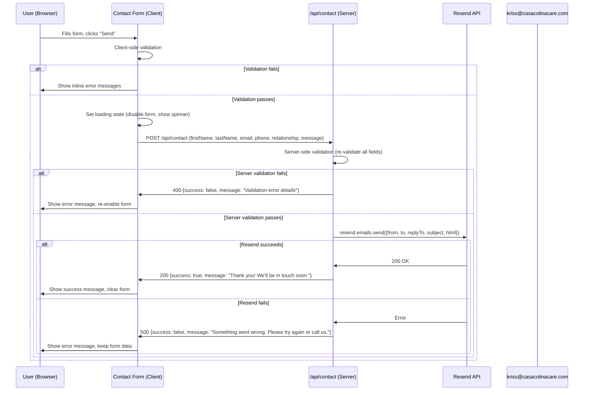

# Project Specification for CasaColinaCare.com

## 1. Context

### Business Goal

Casa Colina Care LLC needs a website that converts visitors into consultation
requests. The site must communicate warmth, trust, and professionalism for a
care home facility in Hawaii Kai, Hawaii.

### Business Details

- [Company Information](../../ai_docs/business_details.md)

### User Persona

**Primary:** Adult children (ages 35-65) researching care options for an aging
parent. They are anxious, comparison-shopping, and need reassurance that their
loved one will be safe and treated with dignity. They will visit the site on
mobile during lunch breaks or on desktop in the evening.

**Secondary:** Healthcare professionals or social workers referring patients to
care homes.

### Pain Points (What the site solves)

- Families searching for care homes in Hawaii Kai have no online presence to
  evaluate Casa Colina Care
- No way to request a consultation or ask questions without calling
- No FAQ resource to answer common concerns before reaching out

### Success Criteria

- A visitor can request a consultation in under 60 seconds from any page (max 2
  clicks to reach the contact form)
- Contact form submissions arrive at kriss@casacolinacare.com via Resend
- Site loads in under 3 seconds on 4G mobile (Lighthouse Performance score > 90)
- All pages are fully responsive from 320px to 2560px viewport width
- Site ranks for "care home Hawaii Kai" within 6 months of launch (SEO
  foundations in place)

---

## 2. Constraints & Boundaries

### Tech Stack

| Layer          | Technology                                | Version                      |
| -------------- | ----------------------------------------- | ---------------------------- |
| Framework      | Next.js (App Router)                      | 15.x                         |
| Language       | TypeScript                                | 5.x                          |
| Styling        | Tailwind CSS                              | 3.x                          |
| UI Components  | Shadcn/ui                                 | latest                       |
| Icons          | Lucide React                              | latest                       |
| Email Delivery | Resend                                    | latest                       |
| Fonts          | Playfair Display (headings), Inter (body) | Google Fonts via `next/font` |

### Hosting & Deployment

- **Platform:** Vercel (free tier)
- **Rendering:** Static Site Generation (SSG) for all pages. The contact form
  API route runs as a Vercel serverless function.
- **Note:** `output: 'export'` is NOT used because it disables API routes.
  Vercel's default SSG provides equivalent static performance while supporting
  the `/api/contact` serverless endpoint.

### Must Have (Pages)

1. Home page
2. About Us page
3. FAQ page
4. Contact page (with web form)

### Must Have (Features)

- Sticky header with navigation and "Request Consultation" CTA
- Mobile hamburger menu (Shadcn Sheet)
- Contact form that sends email via Resend to kriss@casacolinacare.com
- Click-to-call phone link on every page
- Google Maps embed on contact page
- SEO metadata, Open Graph tags, JSON-LD structured data
- Responsive design (mobile-first)
- Accessible (semantic HTML, WCAG touch targets, skip-to-content link)

### Negative Constraints

1. The system shall NOT collect or store any form data in a database — emails
   are sent and forgotten
2. The system shall NOT require user authentication or accounts
3. The system shall NOT include a blog, CMS, or admin panel
4. The system shall NOT process payments or financial information
5. The system shall NOT use client-side JavaScript for navigation (no SPA
   behavior — use Next.js `<Link>`)
6. The contact form shall NOT submit without client-side AND server-side
   validation passing
7. The API route shall NOT expose the Resend API key to the client

---

## 3. Action (Functional Specs)

### 3.1 Site Navigation

**EARS Syntax:**

- When the user loads any page, the system shall display a sticky header with:
  logo (text-based: "Casa Colina Care"), navigation links (Home, About Us, FAQ,
  Contact), and a "Request Consultation" button linking to `/contact`.
- When the viewport width is below 768px, the system shall collapse navigation
  links into a hamburger icon that opens a Sheet-based mobile menu.
- When the user clicks "Request Consultation" from any page, the system shall
  navigate to `/contact`.

**Navigation Links:** | Label | Path | |-------|------| | Home | `/` | | About
Us | `/about` | | FAQ | `/faq` | | Contact | `/contact` |

### 3.2 Home Page (`/`)

**Sections (top to bottom):**

1. **Hero** — Full-viewport-height section with gradient or image background.
   Heading: "Compassionate Care in the Heart of Hawaii Kai". Two CTA buttons:
   "Request a Consultation" (primary, links to `/contact`), "Learn About Us"
   (secondary outline, links to `/about`).

2. **Introduction** — Two-column layout (image placeholder left, text right).
   Heading: "Welcome to Casa Colina Care". 2-3 paragraphs about the facility.
   Link: "Read more about us" to `/about`.

3. **Services Overview** — Heading: "How We Care for Your Family". Four cards in
   a responsive grid:

| Card Title                | Icon (Lucide)     | Description                                                                      |
| ------------------------- | ----------------- | -------------------------------------------------------------------------------- |
| Personalized Care Plans   | `ClipboardList`   | Tailored care plans designed around each resident's unique needs and preferences |
| 24/7 Professional Support | `Shield`          | Round-the-clock attention from trained, compassionate caregivers                 |
| Home-Cooked Meals         | `UtensilsCrossed` | Nutritious, island-inspired meals prepared fresh daily                           |
| Beautiful Surroundings    | `Palmtree`        | Tropical gardens and a peaceful environment in Hawaii Kai                        |

4. **Testimonial/Trust** — Quote-style placeholder on warm sand background. To
   be replaced with real testimonials when available.

5. **CTA Banner** — Heading: "Schedule Your Visit Today". Phone number, email,
   and "Request Consultation" button.

### 3.3 About Us Page (`/about`)

**Sections:**

1. **Page Header** — Title: "About Casa Colina Care", shorter hero banner
2. **Our Story** — Facility history, founding vision, Hawaii Kai community roots
3. **Mission & Values** — Four value cards:
   - Aloha Spirit: Treating every resident with love and respect
   - Dignity & Independence: Supporting autonomy and personal choice
   - Family First: Creating a true home, not an institution
   - Community Connection: Staying connected to Hawaii Kai
4. **Meet Our Team** — Placeholder cards (photo placeholder, name, role, bio)
   for future team member content
5. **CTA Banner** — "Have Questions? We're Here to Help."

### 3.4 FAQ Page (`/faq`)

**Sections:**

1. **Page Header** — Title: "Frequently Asked Questions"
2. **FAQ Accordion** — Shadcn Accordion component, grouped by category:

**General:**

- What type of care does Casa Colina Care provide?
- Where is Casa Colina Care located?
- What makes Casa Colina Care different from other care homes?

**Admissions & Getting Started:**

- How do I begin the admissions process?
- Can I schedule a tour of the facility?
- What should I bring when my loved one moves in?

**Daily Life:**

- What does a typical day look like for residents?
- Are family visits encouraged?
- What meals are provided?

**Care & Services:**

- What level of care is available?
- Is there a nurse on staff?
- How do you handle medical emergencies?

3. **CTA Banner** — "Still Have Questions? Contact Us Directly."

### 3.5 Contact Page (`/contact`)

**Layout:** Two-column on desktop (form left, info right). Stacked on mobile
(form above, info below).

**Left Column — Contact Form:**

| Field                    | Type            | Required | Validation                      |
| ------------------------ | --------------- | -------- | ------------------------------- |
| First Name               | `<Input>` text  | Yes      | Non-empty, max 50 chars         |
| Last Name                | `<Input>` text  | Yes      | Non-empty, max 50 chars         |
| Email                    | `<Input>` email | Yes      | Valid email format (regex)      |
| Phone                    | `<Input>` tel   | No       | If provided, valid phone format |
| Relationship to Resident | `<Input>` text  | No       | Max 100 chars                   |
| Message                  | `<Textarea>`    | Yes      | Non-empty, max 2000 chars       |

Submit button label: "Send Consultation Request"

**Right Column — Contact Info:**

- Phone: +1 (800) 888-8888 (click-to-call `tel:` link)
- Email: kriss@casacolinacare.com (`mailto:` link)
- Address: 189 Anapalua Street, Hawaii Kai, HI 96825
- Google Maps iframe embed
- Hours: "Available for inquiries: Monday–Saturday, 8am–6pm"

### 3.6 Contact Form Submission Flow



### 3.7 API Contract

**POST `/api/contact`**

Request body:

```typescript
interface ContactFormData {
  firstName: string; // required, 1-50 chars
  lastName: string; // required, 1-50 chars
  email: string; // required, valid email
  phone?: string; // optional, valid phone if provided
  relationship?: string; // optional, max 100 chars
  message: string; // required, 1-2000 chars
}
```

Success response (`200`):

```json
{
  "success": true,
  "message": "Thank you! We'll be in touch soon."
}
```

Validation error response (`400`):

```json
{
  "success": false,
  "message": "Please provide a valid email address."
}
```

Server error response (`500`):

```json
{
  "success": false,
  "message": "Something went wrong. Please try again or call us directly."
}
```

**Email sent to kriss@casacolinacare.com:**

- **From:** `Casa Colina Care <noreply@casacolinacare.com>` (requires Resend
  domain verification; use `onboarding@resend.dev` during development)
- **Reply-To:** The submitter's email
- **Subject:** `New Consultation Request from {firstName} {lastName}`
- **Body:** HTML formatted email containing all form fields

---

## 4. Result (UI States & Output)

### Page Metadata

| Page    | Title                                                     | Description                                                                                                                                |
| ------- | --------------------------------------------------------- | ------------------------------------------------------------------------------------------------------------------------------------------ |
| Home    | Casa Colina Care \| Compassionate Care Home in Hawaii Kai | A warm, family-style care home facility in Hawaii Kai, Hawaii. Providing compassionate, personalized care in a beautiful tropical setting. |
| About   | About Us \| Casa Colina Care                              | Learn about Casa Colina Care, our mission, values, and the dedicated team providing compassionate care in Hawaii Kai.                      |
| FAQ     | Frequently Asked Questions \| Casa Colina Care            | Find answers to common questions about Casa Colina Care's services, admissions, and care home life in Hawaii Kai.                          |
| Contact | Contact Us \| Casa Colina Care                            | Get in touch with Casa Colina Care. Request a consultation, schedule a visit, or ask us any questions about our care home in Hawaii Kai.   |

### Contact Form UI States

| State   | Button Text                 | Form Fields              | Message Shown                               |
| ------- | --------------------------- | ------------------------ | ------------------------------------------- |
| Idle    | "Send Consultation Request" | Enabled                  | None                                        |
| Loading | Spinner + "Sending..."      | Disabled                 | None                                        |
| Success | "Send Consultation Request" | Cleared & Enabled        | Green: "Thank you! We'll be in touch soon." |
| Error   | "Send Consultation Request" | Enabled (data preserved) | Red: Error message from API                 |

### Brand Theme

| Token              | Value                              | Usage                                  |
| ------------------ | ---------------------------------- | -------------------------------------- |
| Primary            | `#0D7377` (Ocean Teal)             | Buttons, links, CTAs                   |
| Primary Foreground | `#FFFFFF`                          | Text on primary elements               |
| Secondary          | `#F5E6D3` (Warm Sand)              | Soft backgrounds, alternating sections |
| Accent             | `#E07A5F` (Sunset Coral)           | Hover states, secondary CTAs           |
| Background         | `#FAFAF7` (Ivory)                  | Page background                        |
| Foreground         | `#1A1A2E` (Deep Charcoal)          | Heading and body text                  |
| Muted              | `#E8EDE6` (Soft Sage)              | Muted backgrounds                      |
| Border             | `#E2E8F0`                          | Borders, dividers                      |
| Heading Font       | Playfair Display                   | All `h1`–`h3` elements                 |
| Body Font          | Inter                              | Body text, labels, buttons             |
| Border Radius      | 12px (cards), 8px (buttons/inputs) | Rounded, soft feel                     |

---

## 5. Evaluation (Test Plan)

### Negative Constraints (What the system must NOT do)

1. The contact form shall NOT submit if any required field is empty
2. The API route shall NOT send an email if server-side validation fails
3. The site shall NOT render broken layouts at any viewport width between 320px
   and 2560px

### Assertions

| Assertion                           | Target                                     |
| ----------------------------------- | ------------------------------------------ |
| Lighthouse Performance score        | > 90                                       |
| Lighthouse Accessibility score      | > 90                                       |
| Time to first meaningful paint (4G) | < 3 seconds                                |
| Contact form to submission          | < 60 seconds, max 2 clicks from any page   |
| Layout shift (CLS)                  | < 0.1                                      |
| All navigation links resolve        | 0 broken links                             |
| Form submission sends email         | Email arrives at kriss@casacolinacare.com  |
| Mobile touch targets                | Minimum 44x44px                            |
| HTML heading hierarchy              | Single `h1` per page, sequential `h2`/`h3` |

### Manual Test Checklist

- [ ] All 4 pages render without errors at 375px, 768px, 1280px viewports
- [ ] Header navigation links work on all pages
- [ ] Mobile hamburger menu opens, navigates, and closes
- [ ] Contact form shows validation errors for empty required fields
- [ ] Contact form shows validation error for malformed email
- [ ] Contact form shows loading state during submission
- [ ] Contact form shows success message after successful submission
- [ ] Contact form shows error message if Resend fails
- [ ] Phone number is clickable (tel: link) on mobile
- [ ] Email is clickable (mailto: link)
- [ ] Google Maps embed loads on contact page
- [ ] Open Graph metadata renders correctly (test with og:image debugger)
- [ ] JSON-LD structured data is valid (test with Google Rich Results Test)

---

## 6. File Structure

```
src/
├── app/
│   ├── layout.tsx              # Root layout, fonts, metadata, JSON-LD
│   ├── page.tsx                # Home page
│   ├── globals.css             # Tailwind directives, CSS variables
│   ├── about/
│   │   └── page.tsx            # About Us
│   ├── faq/
│   │   └── page.tsx            # FAQ
│   ├── contact/
│   │   └── page.tsx            # Contact
│   ├── api/
│   │   └── contact/
│   │       └── route.ts        # POST handler, Resend email
│   ├── robots.ts               # robots.txt generation
│   └── sitemap.ts              # sitemap.xml generation
├── components/
│   ├── ui/                     # Shadcn/ui (auto-generated)
│   ├── layout/
│   │   ├── header.tsx
│   │   ├── footer.tsx
│   │   └── mobile-nav.tsx
│   ├── sections/
│   │   ├── hero.tsx
│   │   ├── intro.tsx
│   │   ├── services-overview.tsx
│   │   ├── testimonial.tsx
│   │   ├── cta-banner.tsx
│   │   └── contact-form.tsx
│   └── shared/
│       ├── section-heading.tsx
│       └── map-embed.tsx
├── lib/
│   ├── utils.ts                # Shadcn/ui utility (auto-generated)
│   ├── fonts.ts                # Font configuration
│   ├── constants.ts            # Business info, nav links
│   └── email.ts                # Resend email builder
└── types/
    └── contact.ts              # ContactFormData, ContactFormResponse
```

---

## 7. Open Items (Require Client Input)

- [ ] Facility photos (placeholder images used until provided)
- [ ] Logo file (text-based "Casa Colina Care" used as default)
- [ ] Team member info — names, roles, photos, bios
- [ ] FAQ content review — are the placeholder questions accurate?
- [ ] Resend account setup — sign up, verify casacolinacare.com domain, obtain
      API key
