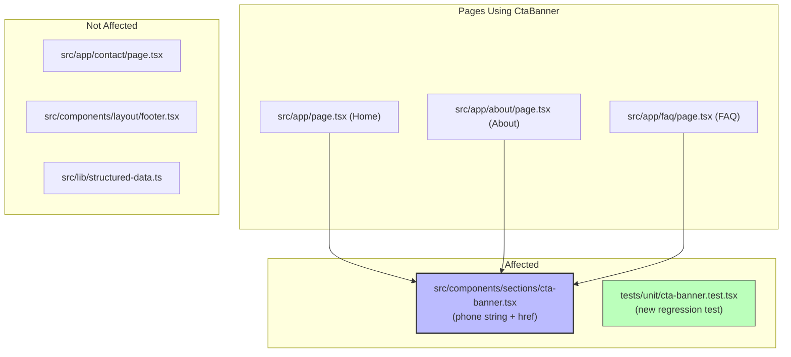

# CTA Banner Phone Number Fix - Technical Design Document

| Field | Value |
|-------|-------|
| **Author(s)** | Ramon Aseniero |
| **Reviewer(s)** | Ramon Aseniero |
| **Status** | Draft |
| **Last Updated** | 2026-03-20 |
| **PRD** | `prds/005_cta_phone_fix/BRD_PRD.md` |
| **ADO Board** | https://dev.azure.com/jairo/CasaColinaCare.com/_boards/board/t/CasaColinaCare.com%20Team/Stories |

---

## 1. Introduction

### 1.1 Background & Problem Statement

The `CtaBanner` component (`src/components/sections/cta-banner.tsx`) displays a placeholder phone number `+1 (800) 888-8888` that was never replaced during the initial site build (PRD 002). PRD 004 corrected phone numbers in the footer, contact page, FAQ, and structured data — but the CTA banner was out of scope. As a result, 3 of 4 site pages (Home, About, FAQ) still show the wrong number in the most prominent call-to-action section.

This is a 2-line string replacement in one file plus a new regression test file. No logic, layout, or behavior changes.

### 1.2 User Stories

From the PRD:

- **US-005-01:** As a prospective resident's family member browsing the website, I want the phone number in the "Schedule Your Visit" banner to be the real Casa Colina Care number so that I can call directly from any page without being misdirected.
- **US-005-02:** As a developer maintaining the codebase, I want an automated test that asserts the CTA banner shows the correct phone number so that any future reintroduction of a placeholder is caught before merging.

### 1.3 Goals & Non-Goals

**Goals:**

- Replace the placeholder phone number with the correct business number in `cta-banner.tsx`
- Add a unit test that catches any reintroduction of the placeholder
- Maintain build, lint, and type-check integrity (exit code 0)

**Non-Goals:**

- Centralizing phone/email/address into `src/lib/constants.ts` (Known Issue #4)
- Making the phone number a configurable prop on `CtaBanner`
- Changes to any other component (footer, contact page, FAQ already fixed)
- E2E tests for this change (unit test is sufficient for a static string)

---

## 2. Architectural Overview

### 2.1 System Context

This change affects **static content only** — no runtime behavior, API contracts, data flow, or component architecture is modified.



**Legend:** Blue = source code change, Green = new test file.

### 2.2 Narrative

The `CtaBanner` is a shared React Server Component used on Home, About, and FAQ pages. It accepts optional props (`heading`, `description`, `buttonText`, `buttonHref`) but the phone number and email are hardcoded in the JSX body — not passed as props. The fix is a direct string replacement at lines 31 and 34. The component has no client-side interactivity, no state, and no API calls.

---

## 3. Design Details

### 3.1 US-005-01: Correct Phone Number in CTA Banner

**Trigger:** Developer executes the change.

**System Behavior (EARS Syntax):**

- **When** any page renders the `CtaBanner` component, the system **shall** display `+1 (808) 200-1840` as the phone number.
- **When** a user clicks the phone link, the system **shall** initiate a call to `tel:+18082001840`.
- **When** any search for `8008888888` is performed against `src/`, the system **shall** return zero results.

**File:** `src/components/sections/cta-banner.tsx`

**Change:**

```diff
         <a
-            href="tel:+18008888888"
+            href="tel:+18082001840"
             className="transition-colors hover:text-primary-foreground"
           >
-            +1 (800) 888-8888
+            +1 (808) 200-1840
           </a>
```

**Component Architecture:**

- **Server Component:** `CtaBanner` (RSC, no `'use client'`) — renders static HTML at build time via SSG.
- **No client components affected.** The phone link is a plain `<a>` tag with a `tel:` href.
- **Props unchanged.** The `CtaBannerProps` interface (`heading`, `description`, `buttonText`, `buttonHref`) is not modified. The phone number is not a prop.

**Data Model:**

No data model. The phone number is a hardcoded string literal in JSX, not sourced from a data file, API, or prop.

**Caching / Revalidation:**

All pages using `CtaBanner` are SSG with `export const metadata`. After deployment, Vercel rebuilds the static pages automatically. No manual cache invalidation needed.

**Error Handling:**

Not applicable — this is a static string in a static anchor element.

---

### 3.2 US-005-02: Regression Test Guards CTA Banner Phone Number

**Trigger:** Developer creates the test file.

**System Behavior (EARS Syntax):**

- **When** `npm test -- --run` is executed, the system **shall** include test assertions for the CTA banner phone number.
- **When** the placeholder `+1 (800) 888-8888` is reintroduced, the test **shall** fail.

**File:** `tests/unit/cta-banner.test.tsx` (new)

**Test Implementation:**

```typescript
import { render, screen } from '@testing-library/react';
import { describe, expect, test } from 'vitest';

import { CtaBanner } from '@/components/sections/cta-banner';

describe('CtaBanner — Phone Number', () => {
  test('displays correct phone number with correct href', () => {
    render(<CtaBanner />);
    const phoneLink = screen.getByRole('link', { name: /808.*200.*1840/ });
    expect(phoneLink).toBeInTheDocument();
    expect(phoneLink).toHaveAttribute('href', 'tel:+18082001840');
  });

  test('does not contain old placeholder phone number', () => {
    render(<CtaBanner />);
    const body = document.body.textContent ?? '';
    expect(body).not.toContain('(800) 888-8888');
    expect(body).not.toContain('+18008888888');
  });
});
```

**Component Architecture:**

- The test renders `CtaBanner` with default props (no args needed — phone is hardcoded).
- Uses `screen.getByRole('link')` to find the phone anchor by its accessible name.
- Asserts both presence of correct number and absence of placeholder.

---

### 3.3 Shared Architecture Components

**Not applicable.** No shared components, data models, or API contracts are affected. The change is an isolated string replacement plus a new test file.

**Alternatives Considered:**

| Alternative | Description | Reason for Rejection |
|-------------|-------------|----------------------|
| Extract phone to `constants.ts` | Import phone number from centralized constants file | Out of scope — Known Issue #4 tracks this as a separate refactor. P0 fix should be minimal risk. |
| Make phone a prop on `CtaBanner` | Add `phone` to `CtaBannerProps` and pass it from each page | Over-engineering for a static marketing site. Only one phone number exists. No caller currently passes phone as a prop. |
| Fix via `constants.ts` import without full centralization | Import just the phone from constants, leave other data hardcoded | Creates inconsistency — some data centralized, some not. Better to do all-or-nothing in a dedicated refactor. |

---

## 4. Implementation Plan

### 4.1 Phased Rollout Strategy

**Single phase.** Both changes (string replacement + test) are committed and deployed together.

### 4.2 Task Breakdown & Dependency Map

| Order | Task | File(s) | Dependencies |
|-------|------|---------|--------------|
| 1 | Replace phone number strings | `src/components/sections/cta-banner.tsx` | None |
| 2 | Create regression test | `tests/unit/cta-banner.test.tsx` | Task 1 (test asserts the new value) |
| 3 | Run verification suite | — | Tasks 1-2 |

### 4.3 Data Migration

No data migration required.

---

## 5. Technical Constraints

### TC-005-01: Build Pipeline Integrity

All changes must pass the existing build, lint, and type-check pipelines with exit code 0.

**Rationale**: OBJ-005-01 requires zero regressions
**Impact**: Any syntax error in the modified file would block deployment
**Mitigation**: Run `npm run lint -- --fix && npm run type-check && npm test -- --run` before committing

### TC-005-02: Same-Day Deployment

Implementation and deployment must complete within a single day.

**Rationale**: P0 severity — wrong phone number is actively losing potential leads
**Impact**: No multi-phase rollout; both changes ship together
**Mitigation**: Scope is minimal (2 string replacements + 1 test file)

### TC-005-03: Zero Incremental Cost

No new packages, services, or infrastructure may be added.

**Rationale**: This is a data correction, not a feature
**Impact**: Must use only existing tools (Vitest, React Testing Library)
**Mitigation**: Test file uses the same testing stack already in the project

---

## 6. Testing Strategies

### TEST-005-01: CTA banner displays correct phone number and href

**Related Requirements**: US-005-01, AC-005-01, AC-005-02, US-005-02, AC-005-07, AC-005-09

**Test Type**: Unit
**Framework**: Vitest + React Testing Library
**Location**: `tests/unit/cta-banner.test.tsx`

**Test Steps**:
1. Render `<CtaBanner />` with default props
2. Query for a link element matching the phone number pattern `808.*200.*1840`
3. Assert the link exists in the document
4. Assert the link `href` is `tel:+18082001840`

**Expected Result**: Link found with correct display text and href.

---

### TEST-005-02: CTA banner does not contain old placeholder number

**Related Requirements**: US-005-01, AC-005-03, AC-005-04, US-005-02, AC-005-08

**Test Type**: Unit
**Framework**: Vitest + React Testing Library
**Location**: `tests/unit/cta-banner.test.tsx`

**Test Steps**:
1. Render `<CtaBanner />` with default props
2. Read the full text content of the rendered output
3. Assert `(800) 888-8888` is not in the text
4. Assert `+18008888888` is not in the text

**Expected Result**: Neither the old display text nor the old E.164 number appear anywhere in the rendered component.

---

## 7. Cross-Cutting Concerns

### 7.1 Security & Privacy

Not applicable. No user input, authentication, or PII handling. The change is a static string in server-rendered HTML.

### 7.2 Scalability & Performance

Not applicable. No runtime behavior changes. SSG build time is unaffected by a string value change.

### 7.3 Monitoring & Alerting

Not applicable. No new metrics, logs, or alerts needed.

### 7.4 Deployment & Rollback

- **Deployment:** Standard Vercel deployment via `git push` to `main`. Vercel rebuilds the static pages automatically.
- **Rollback:** `git revert <commit-sha>` restores the previous number. Zero-downtime rollback.

---

## Verification Checklist

| # | Check | Command / Method | Expected Result |
|---|-------|-----------------|-----------------|
| 1 | No placeholder phone in source | `grep -r '8008888888' src/` | No matches |
| 2 | Correct phone in CTA banner | `grep '18082001840' src/components/sections/cta-banner.tsx` | 1 match |
| 3 | Test file exists | `ls tests/unit/cta-banner.test.tsx` | File exists |
| 4 | Lint passes | `npm run lint` | Exit code 0 |
| 5 | Type-check passes | `npm run type-check` | Exit code 0 |
| 6 | Unit tests pass | `npm test -- --run` | Exit code 0 |
| 7 | Build succeeds | `npm run build` | Exit code 0 |

---

## Golden Thread Traceability

| Business Objective | User Story | Design Section | Test Cases |
|--------------------|-----------|----------------|------------|
| OBJ-005-01: Correct phone on all pages | US-005-01 | 3.1 | TEST-005-01, TEST-005-02 |
| OBJ-005-02: Regression test prevents recurrence | US-005-02 | 3.2 | TEST-005-01, TEST-005-02 |
