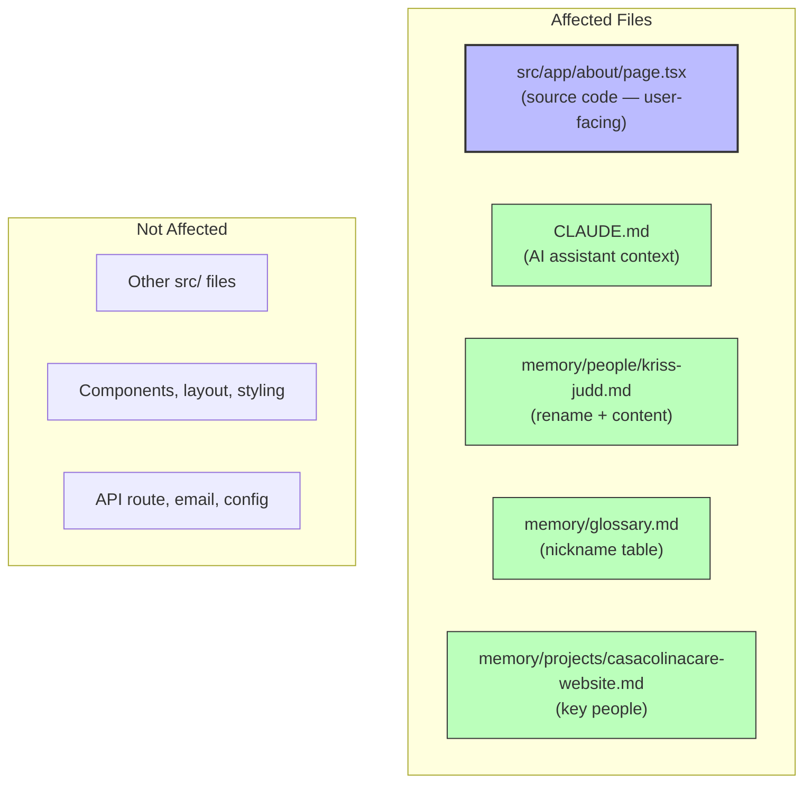

# About Us Founder Name Correction - Technical Design Document

| Field | Value |
|-------|-------|
| **Author(s)** | @jairo |
| **Reviewer(s)** | @jairo |
| **Status** | Draft |
| **Last Updated** | 2026-03-05 |
| **PRD** | `prds/006_about_founder_name/BRD_PRD.md` |
| **ADO Board** | https://dev.azure.com/jairo/CasaColinaCare.com/_boards/board/t/CasaColinaCare.com%20Team/Stories |

---

## 1. Introduction

### 1.1 Background & Problem Statement

The About page team section displays "Kriss Judd" as the founder name. The correct name is "Kriss Aseniero." The error was introduced during the initial site build (PRD 002) and propagated into multiple documentation files. This is a static string replacement across source code and documentation — no logic, layout, or behavior changes.

**PRD Gap Identified:** The PRD scopes 3 files (`src/app/about/page.tsx`, `CLAUDE.md`, `memory/people/kriss-judd.md`). A codebase-wide grep reveals **5 files** containing "Kriss Judd." Two additional documentation files were missed:

| # | File | Line | Context |
|---|------|------|---------|
| 1 | `src/app/about/page.tsx` | 43 | `name: 'Kriss Judd'` in `team` array |
| 2 | `CLAUDE.md` | 15 | People table: "Kriss Judd, business owner" |
| 3 | `memory/people/kriss-judd.md` | 1 | Heading: `# Kriss Judd` |
| 4 | `memory/glossary.md` | 87 | Nicknames table: "Kriss Judd (business owner, Casa Colina)" |
| 5 | `memory/projects/casacolinacare-website.md` | 22 | Key People: "Kriss Judd — business owner" |

Files 4 and 5 are **additional scope** beyond the PRD. They must be updated to satisfy OBJ-02 (`grep -r 'Kriss Judd' CLAUDE.md memory/` returns no results).

### 1.2 User Stories

From the PRD:

- **US-001:** As a site visitor viewing the About page, I want to see the correct founder name "Kriss Aseniero" so that I have accurate information about who runs the care home.
- **US-002:** As a developer or AI assistant working on the codebase, I want all documentation to reference the correct name "Kriss Aseniero" so that the incorrect name does not propagate into future work.

### 1.3 Goals & Non-Goals

**Goals:**

- Replace every instance of "Kriss Judd" with "Kriss Aseniero" across all 5 affected files
- Rename `memory/people/kriss-judd.md` to `memory/people/kriss-aseniero.md`
- Maintain build, lint, and type-check integrity (exit code 0)

**Non-Goals:**

- Bio text, role titles, or any other content changes
- Changes to other team member entries
- Profile images or headshots
- Pages other than About (source code)
- Contact information updates

---

## 2. Architectural Overview

### 2.1 System Context

This change affects **static content only** — no runtime behavior, API contracts, data flow, or component architecture is modified.



**Legend:** Blue = source code (user-facing), Green = documentation (developer/AI-facing).

### 2.2 Narrative

The About page (`src/app/about/page.tsx`) is a React Server Component that renders a static `team` array. The founder entry at index 0 has `name: 'Kriss Judd'` which renders directly into the HTML. Changing the string value is the only source code modification. The remaining 4 files are Markdown documentation consumed by AI assistants and developers — they have no build-time or runtime dependencies.

---

## 3. Design Details

### 3.1 US-001: Update Founder Name in About Page

**Trigger:** Developer executes the change.

**System Behavior (EARS Syntax):**

- **When** the About page renders the team section, the system **shall** display "Kriss Aseniero" as the name for the first team member entry.
- **When** any search for "Kriss Judd" is performed against `src/`, the system **shall** return zero results.

**File:** `src/app/about/page.tsx`

**Change:**

```diff
 const team = [
   {
-    name: 'Kriss Judd',
+    name: 'Kriss Aseniero',
     role: 'Founder & Director',
     bio: 'With years of experience in senior care...',
   },
```

**Component Architecture:**

- **Server Component:** `AboutPage` (RSC, no `'use client'`) — renders the `team` array as static HTML at build time via SSG.
- **No client components affected.** The team section has no interactivity.
- **No shared components affected.** `SectionHeading` and `CtaBanner` receive no name-related props.

**Data Model:**

The `team` array is an inline constant (not a separate data file or API response). No schema change required — only the string value at `team[0].name`.

```json
{
  "title": "TeamMember",
  "type": "object",
  "properties": {
    "name": { "type": "string", "description": "Display name" },
    "role": { "type": "string", "description": "Job title" },
    "bio": { "type": "string", "description": "Short biography" }
  },
  "required": ["name", "role", "bio"]
}
```

No changes to this shape. Only the value of `name` for `team[0]` changes.

**Caching / Revalidation:**

The About page uses SSG (`export const metadata` with no `revalidate`). After deployment, Vercel rebuilds the static page automatically. No manual cache invalidation needed.

**Error Handling:**

Not applicable — this is a static string in a static array. No runtime errors, validation, or error boundaries are involved.

---

### 3.2 US-002: Update Documentation References

**Trigger:** Developer executes the changes alongside US-001.

**System Behavior (EARS Syntax):**

- **When** `grep -r 'Kriss Judd' CLAUDE.md memory/` is executed, the system **shall** return zero results.
- **When** the file `memory/people/kriss-judd.md` is checked, it **shall** not exist.
- **When** the file `memory/people/kriss-aseniero.md` is checked, it **shall** exist with heading `# Kriss Aseniero`.

**Files & Changes:**

#### 3.2.1 `CLAUDE.md` (line 15)

```diff
-| **Kriss** | Kriss Judd, business owner — Casa Colina Care LLC (kriss@casacolinacare.com) |
+| **Kriss** | Kriss Aseniero, business owner — Casa Colina Care LLC (kriss@casacolinacare.com) |
```

#### 3.2.2 `memory/people/kriss-judd.md` → `memory/people/kriss-aseniero.md`

1. **Rename** the file from `kriss-judd.md` to `kriss-aseniero.md`
2. **Update** the heading inside:

```diff
-# Kriss Judd
+# Kriss Aseniero
```

All other content (email, role, contact info, notes) remains unchanged.

#### 3.2.3 `memory/glossary.md` (line 87) — **Additional scope**

```diff
-| Kriss | Kriss Judd (business owner, Casa Colina) |
+| Kriss | Kriss Aseniero (business owner, Casa Colina) |
```

#### 3.2.4 `memory/projects/casacolinacare-website.md` (line 22) — **Additional scope**

```diff
-- **Kriss Judd** — business owner, receives contact form emails
+- **Kriss Aseniero** — business owner, receives contact form emails
```

---

### 3.3 Shared Architecture Components

**Not applicable.** No shared components, data models, or API contracts are affected. All changes are isolated string replacements.

**Alternatives Considered:**

| Alternative | Description | Reason for Rejection |
|-------------|-------------|----------------------|
| Extract team data to `constants.ts` | Centralize team member data in `src/lib/constants.ts` alongside other business info | Out of scope — the PRD explicitly limits this to a name correction. Centralization is a separate refactoring concern (known issue #4 in CLAUDE.md). |
| Partial update (PRD scope only) | Update only the 3 files listed in the PRD | Insufficient — `grep` verification (OBJ-02 acceptance criteria) would fail because `memory/glossary.md` and `memory/projects/casacolinacare-website.md` also contain the old name. |

---

## 4. Implementation Plan

### 4.1 Phased Rollout Strategy

**Single phase.** All 5 file changes are committed and deployed together. No phasing needed for a string replacement.

### 4.2 Task Breakdown & Dependency Map

| Order | Task | File(s) | Dependencies |
|-------|------|---------|--------------|
| 1 | Replace name in team array | `src/app/about/page.tsx` | None |
| 2 | Update People table | `CLAUDE.md` | None |
| 3 | Rename + update memory file | `memory/people/kriss-judd.md` → `kriss-aseniero.md` | None |
| 4 | Update glossary nickname | `memory/glossary.md` | None |
| 5 | Update project key people | `memory/projects/casacolinacare-website.md` | None |
| 6 | Run verification suite | — | Tasks 1-5 |

All tasks 1-5 are independent and can be executed in any order or in parallel.

### 4.3 Data Migration

No data migration required.

---

## 5. Testing Strategies

### 5.1 Unit Tests (Vitest + React Testing Library)

**Location:** `tests/unit/app/about/page.test.tsx`

**TC-001: About page renders "Kriss Aseniero"**

```typescript
import { render, screen } from '@testing-library/react';
import AboutPage from '@/app/about/page';

test('renders correct founder name', () => {
  render(<AboutPage />);
  expect(screen.getByText('Kriss Aseniero')).toBeInTheDocument();
});
```

**TC-002: About page does not contain "Kriss Judd"**

```typescript
test('does not render old founder name', () => {
  render(<AboutPage />);
  expect(screen.queryByText('Kriss Judd')).not.toBeInTheDocument();
});
```

**Run:** `npm test -- --run`

### 5.2 E2E Test (Playwright)

**Location:** `tests/e2e/about.spec.ts`

**TC-003: About page displays correct founder name**

```typescript
import { test, expect } from '@playwright/test';

test('about page shows correct founder name', async ({ page }) => {
  await page.goto('/about');
  await expect(page.locator('text=Kriss Aseniero')).toBeVisible();
  await expect(page.locator('text=Kriss Judd')).not.toBeVisible();
});
```

**Run:** `npm run test:e2e`

### 5.3 Grep Verification (Manual / CI)

```bash
# Must return 0 results (exit code 1 = no matches = success)
grep -r 'Kriss Judd' src/ CLAUDE.md memory/
```

### 5.4 Build Integrity

```bash
npm run lint -- --fix && npm run type-check && npm test -- --run
```

All three must exit with code 0.

---

## 6. Cross-Cutting Concerns

### 6.1 Security & Privacy

Not applicable. No user input, authentication, authorization, or PII handling is involved. The change is a static string in server-rendered HTML.

### 6.2 Scalability & Performance

Not applicable. No runtime behavior changes. SSG build time is unaffected by a string value change.

### 6.3 Monitoring & Alerting

Not applicable. No new metrics, logs, or alerts needed.

### 6.4 Deployment & Rollback

- **Deployment:** Standard Vercel deployment via `git push` to `main`. Vercel rebuilds the static About page automatically.
- **Rollback:** `git revert <commit-sha>` restores the previous name. Zero-downtime rollback.

---

## Verification Checklist

| # | Check | Command / Method | Expected Result |
|---|-------|-----------------|-----------------|
| 1 | No "Kriss Judd" in source | `grep -r 'Kriss Judd' src/` | No matches |
| 2 | No "Kriss Judd" in docs | `grep -r 'Kriss Judd' CLAUDE.md memory/` | No matches |
| 3 | Old memory file gone | `ls memory/people/kriss-judd.md` | File not found |
| 4 | New memory file exists | `ls memory/people/kriss-aseniero.md` | File exists |
| 5 | Lint passes | `npm run lint` | Exit code 0 |
| 6 | Type-check passes | `npm run type-check` | Exit code 0 |
| 7 | Unit tests pass | `npm test -- --run` | Exit code 0 |
| 8 | Build succeeds | `npm run build` | Exit code 0 |

---

## Golden Thread Traceability

| Business Objective | User Story | Design Section | Test Cases |
|--------------------|-----------|----------------|------------|
| OBJ-01: Zero "Kriss Judd" in `src/` | US-001 | 3.1 | TC-001, TC-002, TC-003 |
| OBJ-02: Zero "Kriss Judd" in docs | US-002 | 3.2 | Grep verification |
| OBJ-03: Build/lint/type integrity | US-001, US-002 | — | Verification checklist #5-8 |
