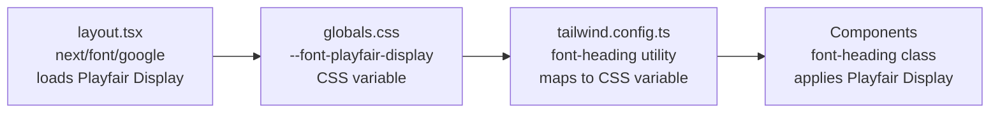

# Logo Update — Technical Specification

## Document Metadata

- **Feature ID**: 008
- **Feature Name**: logo_update
- **Document Type**: TECH_SPEC
- **Generated Date**: 2026-03-09
- **Source PRD**: [BRD_PRD.md](./BRD_PRD.md)

## Document Control

| Attribute | Details |
|-----------|---------|
| **Document Type** | Technical Specification |
| **Version** | 1.0 |
| **Status** | Draft |
| **Author** | Ramon Aseniero (ramon@jairosoft.com) |
| **Last Updated** | 2026-03-09 |

---

## 1. Introduction

### 1.1 Background

The Casa Colina Care website text-based logo ("Casa Colina Care") currently renders in Inter (sans-serif) via the default `font-sans` inheritance, while all page headings (h1–h3) use Playfair Display (serif) via the `font-heading` Tailwind utility. This typographic disconnect weakens brand cohesion.

This specification defines the exact code changes required to apply `font-heading` to all three logo instances, achieving 100% typographic consistency between the logo and headings.

### 1.2 Referenced User Stories

| Story ID | Summary |
|----------|---------|
| US-008-01 | Header logo font update |
| US-008-02 | Footer logo font consistency |
| US-008-03 | Mobile navigation logo font consistency |
| US-008-04 | Quality assurance — no regressions |

### 1.3 Goals & Non-Goals

**Goals:**
- Apply Playfair Display to all logo instances via the existing `font-heading` class
- Maintain all existing functionality (links, layout, responsiveness)
- Add unit and E2E tests validating the font change

**Non-Goals:**
- Image/SVG logo replacement
- Logo color, size, or weight changes
- New font packages or Tailwind configuration
- Favicon updates

---

## 2. Architectural Overview

### 2.1 Font Loading Pipeline

No architectural changes are required. The font-heading pipeline is already fully configured:



### 2.2 Existing Infrastructure (No Changes Needed)

| File | Role | Status |
|------|------|--------|
| `src/app/layout.tsx` | Loads Playfair Display via `next/font/google` | Already configured |
| `src/styles/globals.css` | Defines `--font-playfair-display` CSS variable | Already configured |
| `tailwind.config.ts` (lines 18–23) | Maps `font-heading` → `var(--font-playfair-display)` | Already configured |

### 2.3 Impact Assessment

- **Bundle size**: No change (no new fonts or packages)
- **Performance**: No change (Playfair Display already preloaded via `next/font`)
- **Layout shift**: None expected (same text content, similar glyph metrics at `text-xl`)
- **Breaking changes**: None

---

## 3. Design Details

### 3.1 US-008-01 — Header Logo Font Update

**File:** `src/components/layout/header.tsx`
**Line:** 24

**Current code:**
```tsx
<Link href="/" className="text-xl font-bold tracking-tight">
  Casa Colina Care
</Link>
```

**Updated code:**
```tsx
<Link href="/" className="font-heading text-xl font-bold tracking-tight">
  Casa Colina Care
</Link>
```

**Change:** Add `font-heading` class to the `<Link>` element's `className`.

**Acceptance criteria validated:**
- AC-008-01: `font-heading` class applied → Playfair Display rendered
- AC-008-02: `font-bold` and `tracking-tight` retained (unchanged)
- AC-008-03: `<Link href="/">` preserved (unchanged)
- AC-008-04: No size changes; legibility maintained at all viewports

---

### 3.2 US-008-02 — Footer Logo Font Consistency

**File:** `src/components/layout/footer.tsx`
**Line:** 17

**Current code:**
```tsx
<h3 className="text-lg font-bold tracking-tight">
  Casa Colina Care
</h3>
```

**Updated code:**
```tsx
<h3 className="font-heading text-lg font-bold tracking-tight">
  Casa Colina Care
</h3>
```

**Change:** Add `font-heading` class to the `<h3>` element's `className`.

**Acceptance criteria validated:**
- AC-008-05: `font-heading` class applied → Playfair Display rendered
- AC-008-06: Same `font-heading` utility as header → identical font-family

---

### 3.3 US-008-03 — Mobile Navigation Logo Font Consistency

**File:** `src/components/layout/mobile-nav.tsx`
**Line:** 41

**Current code:**
```tsx
<SheetTitle>Casa Colina Care</SheetTitle>
```

**Updated code:**
```tsx
<SheetTitle className="font-heading">Casa Colina Care</SheetTitle>
```

**Change:** Add `className="font-heading"` prop to the `<SheetTitle>` component.

**Implementation note:** `SheetTitle` (defined in `src/components/ui/sheet.tsx`, line 111) already applies `text-lg font-semibold text-foreground` via its internal `cn()` call. The `className` prop is merged by `cn()`, so `font-heading` adds to (does not replace) the existing styles.

**Acceptance criteria validated:**
- AC-008-07: `font-heading` class applied via `className` prop → Playfair Display rendered
- AC-008-08: Same `font-heading` utility as header and footer → identical font-family

---

### 3.4 US-008-04 — Quality Assurance

**Health check commands (must all pass):**

```bash
npm run lint -- --fix      # AC-008-09: No lint errors
npm run type-check         # AC-008-10: No type errors
npm test -- --run          # AC-008-11: All unit tests pass
```

**Lighthouse CLS verification (AC-008-12):**
- Run Lighthouse on all 4 pages: `/`, `/about`, `/faq`, `/contact`
- Verify CLS score < 0.1 on each page
- No new font is loaded, so CLS should remain unchanged

---

## 4. Implementation Plan

### 4.1 Phase 1 — Single Phase (~1 hour)

| Step | Task | File(s) | Estimated Time |
|------|------|---------|---------------|
| 1 | Add `font-heading` to header logo | `src/components/layout/header.tsx` | 2 min |
| 2 | Add `font-heading` to footer logo | `src/components/layout/footer.tsx` | 2 min |
| 3 | Add `font-heading` to mobile nav logo | `src/components/layout/mobile-nav.tsx` | 2 min |
| 4 | Create unit tests (TEST-008-01..03) | `tests/unit/` | 20 min |
| 5 | Create E2E test (TEST-008-04) | `tests/e2e/` | 15 min |
| 6 | Run full health check | — | 5 min |
| 7 | Visual verification at breakpoints | — | 10 min |

### 4.2 File Change Summary

| File | Change Type | Lines Modified |
|------|------------|----------------|
| `src/components/layout/header.tsx` | Modified | 1 (line 24) |
| `src/components/layout/footer.tsx` | Modified | 1 (line 17) |
| `src/components/layout/mobile-nav.tsx` | Modified | 1 (line 41) |
| `tests/unit/header-logo.test.tsx` | New | ~25 |
| `tests/unit/footer-logo.test.tsx` | New | ~25 |
| `tests/unit/mobile-nav-logo.test.tsx` | New | ~25 |
| `tests/e2e/logo-consistency.spec.ts` | New | ~40 |

**Total:** 3 files modified, 4 files created

---

## 5. Technical Constraints

| ID | Constraint | Rationale |
|----|-----------|-----------|
| TC-008-01 | Must use existing `font-heading` Tailwind utility class — no custom CSS | Playfair Display is already configured in `tailwind.config.ts` (lines 18–23). Adding custom CSS would bypass the design system. |
| TC-008-02 | No new npm packages or font files may be added | Playfair Display is already loaded via `next/font/google` in `layout.tsx`. No additional dependencies are needed. |
| TC-008-03 | Logo must remain a text-based `<Link>` component | The logo is not being replaced with an image. It remains a navigable text link to the home page. |

---

## 6. Testing Strategies

### 6.1 Unit Tests (Vitest + React Testing Library)

Tests follow the existing project convention established in `tests/unit/footer.test.tsx`:
- `render()` → `screen` queries → `expect` assertions
- `describe` blocks reference user story IDs
- Test IDs use feature number 008

| Test ID | File | What It Validates | Maps To |
|---------|------|-------------------|---------|
| TEST-008-01 | `tests/unit/header-logo.test.tsx` | Header logo `<Link>` renders with `font-heading` class | AC-008-01, AC-008-02, AC-008-03 |
| TEST-008-02 | `tests/unit/footer-logo.test.tsx` | Footer logo `<h3>` renders with `font-heading` class | AC-008-05, AC-008-06 |
| TEST-008-03 | `tests/unit/mobile-nav-logo.test.tsx` | Mobile `SheetTitle` renders with `font-heading` class | AC-008-07, AC-008-08 |

#### TEST-008-01 — Header Logo Font (Unit)

```tsx
import { render, screen } from '@testing-library/react';
import { describe, expect, test } from 'vitest';

import { Header } from '@/components/layout/header';

describe('Header Logo — Font Update (US-008-01)', () => {
  test('TEST-008-01: header logo has font-heading class', () => {
    render(<Header />);
    const logo = screen.getByRole('link', { name: /casa colina care/i });
    expect(logo).toHaveClass('font-heading');
  });

  test('TEST-008-01a: header logo retains font-bold and tracking-tight', () => {
    render(<Header />);
    const logo = screen.getByRole('link', { name: /casa colina care/i });
    expect(logo).toHaveClass('font-bold');
    expect(logo).toHaveClass('tracking-tight');
  });

  test('TEST-008-01b: header logo links to home page', () => {
    render(<Header />);
    const logo = screen.getByRole('link', { name: /casa colina care/i });
    expect(logo).toHaveAttribute('href', '/');
  });
});
```

#### TEST-008-02 — Footer Logo Font (Unit)

```tsx
import { render, screen } from '@testing-library/react';
import { describe, expect, test } from 'vitest';

import { Footer } from '@/components/layout/footer';

describe('Footer Logo — Font Consistency (US-008-02)', () => {
  test('TEST-008-02: footer logo h3 has font-heading class', () => {
    render(<Footer />);
    const heading = screen.getByRole('heading', { name: /casa colina care/i });
    expect(heading).toHaveClass('font-heading');
  });

  test('TEST-008-02a: footer logo retains font-bold and tracking-tight', () => {
    render(<Footer />);
    const heading = screen.getByRole('heading', { name: /casa colina care/i });
    expect(heading).toHaveClass('font-bold');
    expect(heading).toHaveClass('tracking-tight');
  });
});
```

#### TEST-008-03 — Mobile Nav Logo Font (Unit)

```tsx
import { render, screen } from '@testing-library/react';
import { describe, expect, test, vi } from 'vitest';

import { MobileNav } from '@/components/layout/mobile-nav';

describe('Mobile Nav Logo — Font Consistency (US-008-03)', () => {
  test('TEST-008-03: mobile nav SheetTitle has font-heading class', () => {
    render(<MobileNav pathname="/" />);
    const title = screen.getByText('Casa Colina Care');
    expect(title).toHaveClass('font-heading');
  });
});
```

### 6.2 E2E Test (Playwright)

Follows the convention established in `tests/e2e/footer-contact.spec.ts`:
- `test.describe` with `beforeEach` navigation
- Locator-based assertions

| Test ID | File | What It Validates | Maps To |
|---------|------|-------------------|---------|
| TEST-008-04 | `tests/e2e/logo-consistency.spec.ts` | All 3 logo instances use Playfair Display computed font-family | AC-008-01, AC-008-05, AC-008-07, AC-008-08 |

#### TEST-008-04 — Logo Font Consistency (E2E)

```typescript
import { expect, test } from '@playwright/test';

test.describe('Logo Typography Consistency (US-008-01, US-008-02, US-008-03)', () => {
  test.beforeEach(async ({ page }) => {
    await page.goto('/');
  });

  test('TEST-008-04: all logo instances use Playfair Display font-family', async ({
    page,
  }) => {
    // Header logo
    const headerLogo = page.locator('header a[href="/"]').first();
    const headerFont = await headerLogo.evaluate(
      el => getComputedStyle(el).fontFamily,
    );
    expect(headerFont).toContain('Playfair Display');

    // Footer logo
    const footerLogo = page
      .getByRole('contentinfo')
      .getByRole('heading', { name: /casa colina care/i });
    const footerFont = await footerLogo.evaluate(
      el => getComputedStyle(el).fontFamily,
    );
    expect(footerFont).toContain('Playfair Display');

    // All logo fonts match
    expect(headerFont).toBe(footerFont);
  });

  test('TEST-008-04a: mobile nav logo uses Playfair Display', async ({
    page,
  }) => {
    // Set mobile viewport
    await page.setViewportSize({ width: 375, height: 812 });
    await page.reload();

    // Open mobile nav
    const menuButton = page.getByRole('button', { name: /toggle menu/i });
    await menuButton.click();

    // Verify mobile nav logo font
    const mobileTitle = page.getByRole('heading', {
      name: /casa colina care/i,
    });
    await expect(mobileTitle).toBeVisible();
    const mobileFont = await mobileTitle.evaluate(
      el => getComputedStyle(el).fontFamily,
    );
    expect(mobileFont).toContain('Playfair Display');
  });
});
```

### 6.3 Regression Tests

All existing tests must continue to pass:

```bash
npm run lint -- --fix        # Lint & auto-fix
npm run type-check           # TypeScript strict mode
npm test -- --run            # Unit tests (Vitest)
npm run test:e2e             # E2E tests (Playwright)
```

---

## 7. Cross-Cutting Concerns

### 7.1 Accessibility

- **Contrast ratio:** Unchanged. Logo text color remains `foreground` (Deep Charcoal #1A1A2E) on `background` (Ivory #FAFAF7), exceeding WCAG 2.1 AA 4.5:1 minimum.
- **Font legibility:** Playfair Display is a well-established serif typeface with strong glyph definition at `text-xl` (~20px) and `text-lg` (~18px) sizes.
- **Screen readers:** No change. Text content and semantic structure remain identical.

### 7.2 Performance

- **No new font download:** Playfair Display is already loaded via `next/font/google` in `layout.tsx` and preloaded on every page.
- **No bundle size increase:** Only Tailwind class additions — no new imports, components, or packages.
- **CLS impact:** None expected. The `next/font` integration uses `font-display: swap` with size-adjust, and Playfair Display is already in the font loading chain.

### 7.3 Browser Compatibility

| Browser | Version | Expected Support |
|---------|---------|-----------------|
| Chrome | Latest 2 | Full support |
| Safari | Latest 2 | Full support |
| Firefox | Latest 2 | Full support |
| Edge | Latest 2 | Full support |

Playfair Display is loaded as a web font via Google Fonts / `next/font` — no browser-specific font rendering issues expected. Manual visual verification recommended on all listed browsers.

### 7.4 Rollback Plan

If the font change causes unexpected issues:

1. Revert the 3 modified files to remove `font-heading` class additions
2. Delete the 4 new test files
3. The change is fully reversible with no side effects

---

## Traceability Matrix

| Business Objective | User Story | Acceptance Criteria | Technical Constraint | Test Case |
|---|---|---|---|---|
| OBJ-008-01 | US-008-01 | AC-008-01, AC-008-02, AC-008-03, AC-008-04 | TC-008-01, TC-008-03 | TEST-008-01 |
| OBJ-008-01 | US-008-02 | AC-008-05, AC-008-06 | TC-008-01 | TEST-008-02 |
| OBJ-008-01 | US-008-03 | AC-008-07, AC-008-08 | TC-008-01 | TEST-008-03 |
| OBJ-008-01 | US-008-04 | AC-008-09, AC-008-10, AC-008-11, AC-008-12 | TC-008-02 | TEST-008-04 |

---

## Appendix: ID Registry

### IDs Defined in This Document

| ID | Type | Description |
|----|------|-------------|
| TC-008-01 | Technical Constraint | Must use existing `font-heading` utility |
| TC-008-02 | Technical Constraint | No new npm packages |
| TC-008-03 | Technical Constraint | Logo remains text-based `<Link>` |
| TEST-008-01 | Unit Test | Header logo `font-heading` class |
| TEST-008-02 | Unit Test | Footer logo `font-heading` class |
| TEST-008-03 | Unit Test | Mobile nav `font-heading` class |
| TEST-008-04 | E2E Test | All logos use Playfair Display computed font |

### IDs Referenced from BRD_PRD.md

| ID | Type |
|----|------|
| OBJ-008-01 | Business Objective |
| US-008-01..04 | User Stories |
| AC-008-01..12 | Acceptance Criteria |
| NFR-008-01..04 | Non-Functional Requirements |
| RISK-008-01..03 | Risk Items |
