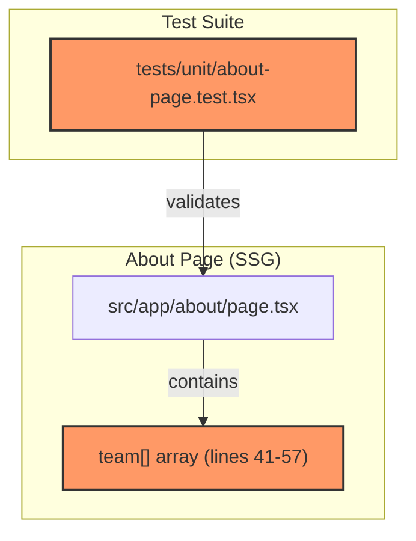
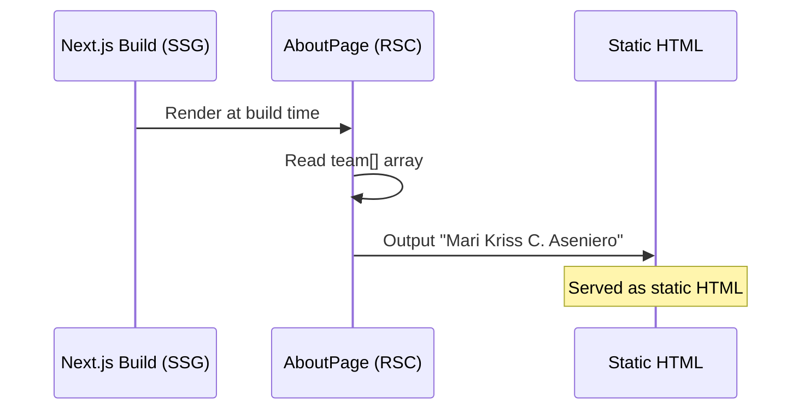

# Fix Founder Name Using Full Name Format — Technical Design Document

| Field | Value |
|-------|-------|
| **Author(s)** | Ramon Aseniero |
| **Status** | Draft |
| **Last Updated** | 2026-03-24 |
| **PRD** | [BRD_PRD.md](BRD_PRD.md) |
| **Feature ID** | 009 |

---

## 1. INTRODUCTION

### 1.1 Background & Problem Statement

The About Us page team section currently displays the founder's name as "Kriss Aseniero" instead of the correct full legal name "Mari Kriss C. Aseniero". The bio text also references "Kriss" as a standalone first name. This was partially addressed in Feature 006 but the full name format (`<firstname> <middle initial> <lastname>`) was not applied — only "Kriss Aseniero" was used.

An existing unit test (`tests/unit/about-page.test.tsx`) actively asserts the **incorrect** name "Kriss Aseniero", which means it will fail after the fix and must be updated as part of this work.

### 1.2 User Stories

- **US-009-01:** As a prospective family member visiting the About Us page, I want to see the founder's complete legal name "Mari Kriss C. Aseniero" so that I can trust the credibility and professionalism of the care facility.
- **US-009-02:** As a developer maintaining the site, I want a regression test that verifies the founder's name uses the full name format so that future changes don't accidentally revert to the incomplete name.

### 1.3 Goals & Non-Goals

**Goals:**
- Update all occurrences of "Kriss Aseniero" to "Mari Kriss C. Aseniero" in source code
- Update the bio text to use the full name instead of just "Kriss"
- Update the existing unit test to validate the correct full name
- Ensure no visual regression at mobile/tablet/desktop breakpoints

**Non-Goals:**
- Centralizing the founder name into `constants.ts` (single-use reference, not worth the abstraction)
- Redesigning the team section layout
- Changing the founder's role title or contact email

---

## 2. ARCHITECTURAL OVERVIEW

### 2.1 System Context



### 2.2 Narrative

The founder's name is hardcoded in the `team` array within `src/app/about/page.tsx`. This is a React Server Component rendered via SSG at build time. There is no indirection — the name string appears directly in the data array and is rendered in JSX via `.map()`. The existing unit test imports `AboutPage` and asserts against the rendered text.

**Affected files (2 total):**

| File | Change |
|------|--------|
| `src/app/about/page.tsx` | Update `name` and `bio` in `team[0]` |
| `tests/unit/about-page.test.tsx` | Update assertions to validate new name |

**Files confirmed unaffected:**
- `src/lib/constants.ts` — no founder name reference
- `src/lib/structured-data.ts` — no founder name reference (email only)
- All other page and component files — no founder name reference

---

## 3. DESIGN DETAILS

### 3.1 US-009-01: Display Founder Full Name in Team Section

**Trigger:** Static site build / page request

**System Behavior (EARS Syntax):**
- **When** the About Us page is rendered, the system **shall** display "Mari Kriss C. Aseniero" as the founder's name in the team section.
- **When** the About Us page is rendered, the system **shall** display a bio that references "Mari Kriss C. Aseniero" (not "Kriss" alone).

**File Locations:**
- Page: `src/app/about/page.tsx`

**Exact Changes Required:**

**Change 1 — Line 43 (`name` field):**
```diff
- name: 'Kriss Aseniero',
+ name: 'Mari Kriss C. Aseniero',
```

**Change 2 — Line 45 (`bio` field):**
```diff
- bio: 'With years of experience in senior care and a deep love for the Hawaii Kai community, Kriss founded Casa Colina Care to provide a home where every resident is treated like family.',
+ bio: 'With years of experience in senior care and a deep love for the Hawaii Kai community, Mari Kriss C. Aseniero founded Casa Colina Care to provide a home where every resident is treated like family.',
```

**Component Architecture:**
- `AboutPage` is a **Server Component** (no `'use client'` directive). No changes to component structure required.
- The `team` array is a local constant — no props, no state, no data fetching involved.

**Rendering Flow:**


**Error Handling:** N/A — no runtime logic, no user input, no API calls.

**Caching:** Page is statically generated. The updated name will be baked into the build output.

---

### 3.2 US-009-02: Regression Test for Founder Name Format

**Trigger:** `npm test -- --run`

**System Behavior (EARS Syntax):**
- **When** the About page unit tests run, the test **shall** assert that "Mari Kriss C. Aseniero" is present in the rendered output.
- **When** the About page unit tests run, the test **shall** assert that "Kriss Aseniero" (without "Mari" prefix) is NOT present in the rendered output.

**File Location:**
- Test: `tests/unit/about-page.test.tsx`

**Current Test (to be replaced):**
```typescript
describe('About Page — Founder Name (US-006-01)', () => {
  test('renders correct founder name "Kriss Aseniero"', () => {
    render(<AboutPage />);
    expect(screen.getByText('Kriss Aseniero')).toBeInTheDocument();
  });

  test('does not render old founder name "Kriss Judd"', () => {
    render(<AboutPage />);
    expect(screen.queryByText('Kriss Judd')).not.toBeInTheDocument();
  });
});
```

**Updated Test:**
```typescript
describe('About Page — Founder Name (US-009-01)', () => {
  test('renders founder full name "Mari Kriss C. Aseniero"', () => {
    render(<AboutPage />);
    expect(screen.getByText('Mari Kriss C. Aseniero')).toBeInTheDocument();
  });

  test('does not render incomplete founder name "Kriss Aseniero" without full name prefix', () => {
    render(<AboutPage />);
    // queryAllByText with a function to find any text node containing
    // "Kriss Aseniero" that does NOT also contain "Mari"
    const nodes = screen.queryAllByText((_content, element) => {
      const text = element?.textContent ?? '';
      return text.includes('Kriss Aseniero') && !text.includes('Mari Kriss C. Aseniero');
    });
    expect(nodes).toHaveLength(0);
  });

  test('does not render old founder name "Kriss Judd"', () => {
    render(<AboutPage />);
    expect(screen.queryByText('Kriss Judd')).not.toBeInTheDocument();
  });
});
```

**Key Design Decision:** The negative test uses `queryAllByText` with a custom matcher function rather than `queryByText('Kriss Aseniero')` because the full name "Mari Kriss C. Aseniero" also contains the substring "Kriss Aseniero". The custom matcher checks that no text node contains "Kriss Aseniero" *without* the "Mari" prefix.

---

## 4. IMPLEMENTATION PLAN

### 4.1 Phased Rollout

**Single phase** — this is a 2-file, 4-line change.

### 4.2 Task Breakdown & Dependency Map

| Order | Task | File | Dependencies | Related Requirements |
|-------|------|------|-------------|---------------------|
| 1 | Update founder `name` field | `src/app/about/page.tsx:43` | None | FR-009-01, AC-009-01 |
| 2 | Update founder `bio` field | `src/app/about/page.tsx:45` | None | FR-009-02, AC-009-02 |
| 3 | Update unit test assertions | `tests/unit/about-page.test.tsx` | Tasks 1-2 | FR-009-03, AC-009-08, AC-009-09, AC-009-10 |
| 4 | Run health check (`lint + type-check + test`) | — | Tasks 1-3 | AC-009-05, AC-009-06, AC-009-07 |
| 5 | Visual inspection at 375px, 768px, 1280px | — | Task 1 | AC-009-04, NFR-009-01 |
| 6 | Grep audit for remaining "Kriss Aseniero" | — | Task 1-2 | AC-009-03 |

### 4.3 Data Migration

No data migration required. This is a static content change.

---

## 5. TECHNICAL CONSTRAINTS

### TC-009-01: Hardcoded Name in Component File

The founder's name is hardcoded directly in `src/app/about/page.tsx` within a local `team` array constant. There is no centralized data source or constant file for team member names.

**Rationale:** The name is only referenced in one file; extracting to a constant would add indirection for a single use.
**Impact:** Changes must be made directly in the component file.
**Mitigation:** The regression test ensures the correct name is enforced at test time.

### TC-009-02: Existing Unit Test Asserts Old Name

The file `tests/unit/about-page.test.tsx` currently asserts `screen.getByText('Kriss Aseniero')`, which will **fail** after the source change. This test must be updated as part of the same changeset.

**Rationale:** Test was written during Feature 006 to validate the name at that time.
**Impact:** If the test is not updated before running `npm test`, the test suite will fail.
**Mitigation:** Update test in the same commit as the source change.

### TC-009-03: Longer Name May Affect Layout

"Mari Kriss C. Aseniero" (25 chars) is longer than "Kriss Aseniero" (15 chars). The team card uses `text-center` with `text-lg font-semibold` and no explicit width constraints or truncation.

**Rationale:** Longer text may wrap differently at narrow viewports.
**Impact:** Potential visual regression on mobile (375px).
**Mitigation:** Visual inspection required at all breakpoints. The card layout uses CSS grid with `gap-8` and full column width, so wrapping should be graceful.

---

## 6. TESTING STRATEGIES

### TEST-009-01: Founder Full Name Renders Correctly

**Related Requirements:** US-009-01, AC-009-01, FR-009-01

**Test Type:** Unit

**Test Steps:**
1. Import and render `AboutPage` component
2. Query for text "Mari Kriss C. Aseniero"

**Expected Result:**
- Element with text "Mari Kriss C. Aseniero" exists in the document

**File:** `tests/unit/about-page.test.tsx`

---

### TEST-009-02: Bio References Full Name

**Related Requirements:** US-009-01, AC-009-02, FR-009-02

**Test Type:** Unit

**Test Steps:**
1. Render `AboutPage` component
2. Search for text containing "Mari Kriss C. Aseniero founded Casa Colina Care"

**Expected Result:**
- Bio text includes the full name, not just "Kriss"

**File:** `tests/unit/about-page.test.tsx`

---

### TEST-009-03: No Incomplete Name Remnants

**Related Requirements:** US-009-01, US-009-02, AC-009-03, AC-009-09

**Test Type:** Unit

**Test Steps:**
1. Render `AboutPage` component
2. Query all text nodes for "Kriss Aseniero" without "Mari" prefix

**Expected Result:**
- Zero matches found — no text node contains "Kriss Aseniero" without the full name

**File:** `tests/unit/about-page.test.tsx`

---

### TEST-009-04: Old Name "Kriss Judd" Not Present

**Related Requirements:** US-009-02

**Test Type:** Unit

**Test Steps:**
1. Render `AboutPage` component
2. Query for text "Kriss Judd"

**Expected Result:**
- No element with text "Kriss Judd" exists

**File:** `tests/unit/about-page.test.tsx`

---

### TEST-009-05: Build Health Check

**Related Requirements:** US-009-01, AC-009-05, AC-009-06, AC-009-07

**Test Type:** Integration

**Test Steps:**
1. Run `npm run lint`
2. Run `npm run type-check`
3. Run `npm test -- --run`

**Expected Result:**
- All three commands pass with zero errors

---

### TEST-009-06: Visual Regression at All Breakpoints

**Related Requirements:** US-009-01, AC-009-04, NFR-009-01

**Test Type:** Manual / E2E

**Test Steps:**
1. Start dev server (`npm run dev`)
2. Navigate to `/about`
3. View team section at 375px, 768px, and 1280px viewport widths

**Expected Result:**
- "Mari Kriss C. Aseniero" is fully visible at all breakpoints
- No text overflow, truncation, or layout breakage

---

### TEST-009-07: Codebase Grep Audit

**Related Requirements:** US-009-01, AC-009-03, GOAL-009-01

**Test Type:** Manual

**Test Steps:**
1. Run `grep -r "Kriss Aseniero" src/` from project root
2. Exclude `prds/` and `tests/` directories

**Expected Result:**
- Zero matches in `src/` directory

---

## 7. CROSS-CUTTING CONCERNS

### 7.1 Security & Privacy

N/A — No user input, no API calls, no data processing.

### 7.2 Scalability & Performance

N/A — Static content change. No runtime performance impact. SSG build time unchanged.

### 7.3 Monitoring & Alerting

N/A — Static page. Vercel deployment preview will show the updated name for visual verification.

### 7.4 Deployment & Rollback

- **Deployment:** Standard Vercel deployment via PR merge to `main`. SSG will bake the new name into the static HTML.
- **Rollback:** `git revert` the commit if needed. Low risk.

---

## Alternatives Considered

### Alternative 1: Centralize founder name in `constants.ts`

- **Description:** Extract `"Mari Kriss C. Aseniero"` to `src/lib/constants.ts` as a named export and reference it in `about/page.tsx`.
- **Pros:** Single source of truth if the name is referenced in multiple places in the future.
- **Cons:** The name is currently only used in one file. Adding a constant adds indirection for a single reference. Over-engineering for the current scope.
- **Reason for Rejection:** Per the Minimalist Mandate — don't create abstractions for single-use values. If a second reference appears later, centralization can be done at that time.
