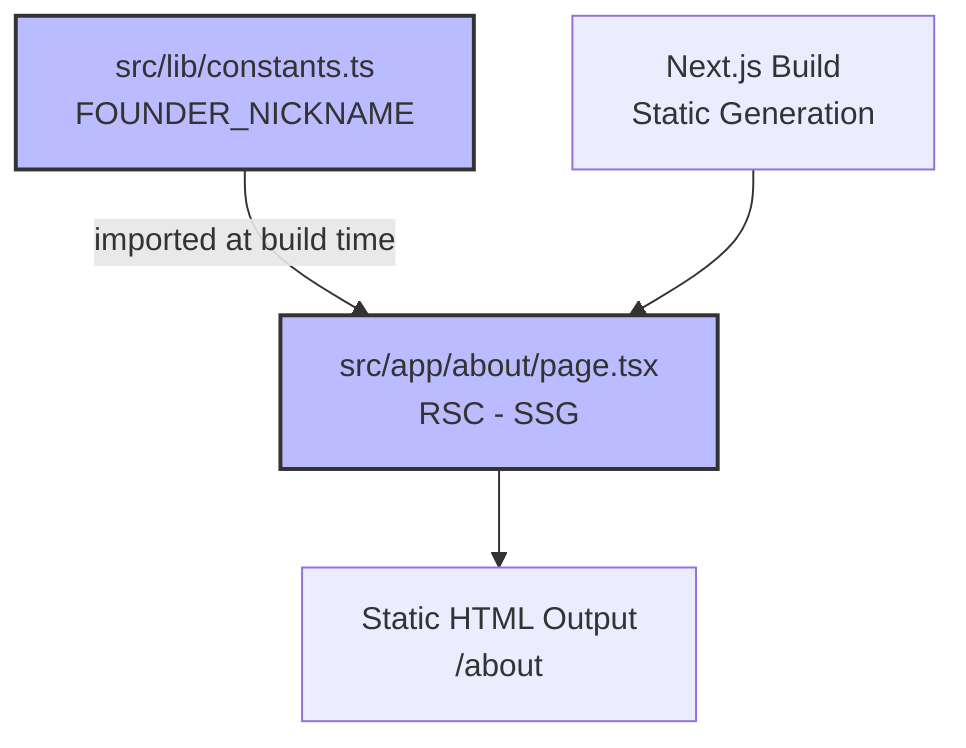
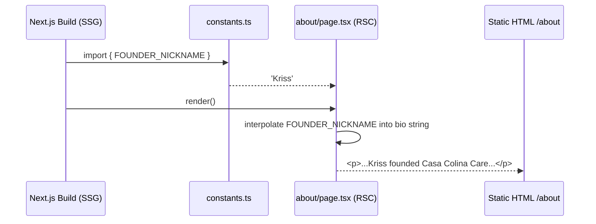

# Founder Nickname in Prose Content — Technical Design Document

| Field | Value |
|-------|-------|
| **Feature ID** | 010 |
| **Author(s)** | Ramon Aseniero |
| **Status** | Draft |
| **Last Updated** | 2026-04-08 |
| **PRD** | `prds/010_nickname/BRD_PRD.md` |

---

## 1. Introduction

### 1.1 Background & Problem Statement

The Casa Colina Care About page contains a team bio for the founder that currently uses her full formal name ("Mari Kriss C. Aseniero") inline within a warm, conversational prose paragraph. This creates a tonal mismatch: formal-name syntax inside a first-person, family-oriented brand voice feels stiff and impersonal to the target audience (adult children researching care for aging parents).

The fix is two-part: (1) define a `FOUNDER_NICKNAME` constant in `src/lib/constants.ts` as the single source of truth for informal founder references, and (2) replace the hardcoded full name in the bio string with an interpolation of that constant. No UI changes, no routing changes, no API changes — this is a pure static-content correction.

### 1.2 User Stories

- **US-010-01**: As a site visitor reading the About page, I want the founder's bio to feel warm and personal, so that I connect with the care home's family-oriented brand.
- **US-010-02**: As a developer adding future content, I want the founder's nickname available as a named constant, so that I never need to guess the correct informal name to use in prose.

### 1.3 Goals & Non-Goals

**Goals:**
- Replace the full formal name in the bio prose with the nickname "Kriss"
- Export `FOUNDER_NICKNAME` from `src/lib/constants.ts` as the canonical informal name
- Add a unit test that guards against regression (bio reverts to full formal name)

**Non-Goals:**
- Changing the formal name displayed in the team card heading (`team[0].name`)
- Modifying JSON-LD structured data, email addresses, or any other surface
- Adding a `FOUNDER_FULL_NAME` constant (out of scope per FR-010-01)
- Any CMS integration, i18n, or runtime data fetching

---

## 2. Architectural Overview

### 2.1 System Context Diagram



### 2.2 Narrative Description

This is a fully static feature. `src/app/about/page.tsx` is a React Server Component rendered at build time via Next.js SSG. No client interaction, no API calls, no runtime state. The `constants.ts` module is imported at build time and the `FOUNDER_NICKNAME` value is inlined into the rendered HTML. The only data flow is: constant → build-time string interpolation → static HTML.

---

## 3. Design Details

### 3.1 US-010-02: Define Founder Nickname as a Codebase Constant

**Trigger:** Build time — module import resolution.

**System Behavior (EARS):**
- **When** `src/app/about/page.tsx` is compiled, the system **shall** resolve `FOUNDER_NICKNAME` from `src/lib/constants.ts`.
- **If** `FOUNDER_NICKNAME` is not exported from `src/lib/constants.ts`, the TypeScript compiler **shall** emit a build error.

**File Location:**
```
src/lib/constants.ts
```

**Constant Definition:**

```typescript
// src/lib/constants.ts
export const FOUNDER_NICKNAME = 'Kriss';
```

**Design Notes:**
- Inferred type (`string literal 'Kriss'` widened to `string`) is sufficient — no `as const` needed since the value is not used in a type-narrowing context.
- This is the first meaningful export in `constants.ts` (currently contains only a comment). No existing exports are affected.
- Export is named, not default — consistent with how this codebase should grow its constants module.

**Component Architecture:**
- No components involved. This is a plain TypeScript module export.
- **Server/Client boundary:** `constants.ts` has no `'use client'` or `'use server'` directive — it is a pure module, importable from both RSCs and Client Components.

**State Management:** None. This is a build-time constant.

**Caching Strategy:** N/A — SSG bakes the value into static HTML at build time.

---

### 3.2 US-010-01: Update Founder Bio to Use Nickname

**Trigger:** Build time — Next.js SSG renders `src/app/about/page.tsx`.

**System Behavior (EARS):**
- **When** the About page is built, the system **shall** render the founder bio using `FOUNDER_NICKNAME` in place of the full formal name.
- **When** the rendered HTML is served, the bio paragraph **shall** contain the text "Kriss founded Casa Colina Care" (not "Mari Kriss C. Aseniero founded Casa Colina Care").
- **If** `team[0].name` is read, it **shall** still return `'Mari Kriss C. Aseniero'` — the formal name card is not modified.

**File Locations:**
```
src/app/about/page.tsx   (line ~1: add import)
src/app/about/page.tsx   (line ~45: update bio string)
```

**Sequence Diagram:**



**Component Architecture:**
- **Server Component (RSC):** `src/app/about/page.tsx` — rendered at build time, no `'use client'` directive required. No change to component type.
- **No new components** introduced.

**Before / After Contract:**

| Location | Before | After |
|----------|--------|-------|
| `about/page.tsx` import block | _(no import from constants)_ | `import { FOUNDER_NICKNAME } from '@/lib/constants';` |
| `team[0].bio` string | `'...Mari Kriss C. Aseniero founded...'` | `` `...${FOUNDER_NICKNAME} founded...` `` |
| `team[0].name` | `'Mari Kriss C. Aseniero'` | Unchanged |

**Data Model (team array entry — unchanged shape):**

```json
{
  "$schema": "http://json-schema.org/draft-07/schema#",
  "title": "TeamMember",
  "type": "object",
  "properties": {
    "name": {
      "type": "string",
      "description": "Formal full name — displayed in card heading. Not modified by this feature.",
      "example": "Mari Kriss C. Aseniero"
    },
    "role": {
      "type": "string",
      "description": "Job title displayed in card.",
      "example": "Founder & Director"
    },
    "bio": {
      "type": "string",
      "description": "Prose bio. Informal name references must use FOUNDER_NICKNAME.",
      "example": "...Kriss founded Casa Colina Care..."
    }
  },
  "required": ["name", "role", "bio"]
}
```

**State Management:** None — static data array, no client state.

**Caching Strategy:** SSG — page is built once per deployment. No `revalidate` or cache tags needed.

**Error Handling:** None required. This is a build-time string interpolation; TypeScript will catch any import/type errors before deployment.

---

### 3.3 Shared Architecture Notes

**Alternatives Considered:**

| Alternative | Pros | Cons | Decision |
|-------------|------|------|----------|
| Hardcode `'Kriss'` directly in bio string (no constant) | Simpler, zero new files | Spelling can drift; future contributors won't know where to look | Rejected — constant is the stated requirement (FR-010-01) |
| `as const` assertion: `export const FOUNDER_NICKNAME = 'Kriss' as const` | Produces literal type `'Kriss'`, prevents reassignment semantics | No practical benefit here — not used in a discriminated union or type guard | Rejected — KISS |
| Add `FOUNDER_FULL_NAME` constant alongside nickname | Centralises all founder identity strings | Out of scope (PRD FR-010-01 is nickname only) | Deferred — can be added in a follow-on |

---

## 4. Implementation Plan

### 4.1 Phased Rollout

This feature is a single atomic change with no phases. All work is done in one story branch, one commit.

### 4.2 Task Breakdown

| Order | Task | File | Dependency |
|-------|------|------|------------|
| 1 | Export `FOUNDER_NICKNAME` constant | `src/lib/constants.ts` | None |
| 2 | Import and use constant in bio string | `src/app/about/page.tsx` | Task 1 |
| 3 | Write unit tests | `tests/unit/lib/constants.test.ts`, `tests/unit/app/about/page.test.tsx` | Tasks 1 & 2 |
| 4 | Run health check | — | Task 3 |

### 4.3 Data Migration

No data migration required. This is a static content change only.

---

## 5. Technical Constraints

The following constraints are carried forward from the PRD and supplemented with one build-system constraint identified during spec authoring.

### TC-010-01: `constants.ts` Is Currently Near-Empty

`src/lib/constants.ts` currently contains only a comment (`// Global constants`). `FOUNDER_NICKNAME` must be the first meaningful export.

**Rationale:** Established in BRD_PRD (TC-010-01).
**Impact:** No risk of naming conflicts with existing exports.
**Mitigation:** None needed.

### TC-010-02: Team Array Is a Plain TypeScript Array

The `team` array in `src/app/about/page.tsx` is a hardcoded TypeScript array literal — no CMS, no API, no database. The bio field is a plain string.

**Rationale:** Established in BRD_PRD (TC-010-02).
**Impact:** Template literal interpolation is the correct mechanism — no JSON parsing, no async fetch.
**Mitigation:** None needed.

### TC-010-03: Static Content Only — No Runtime Layer

No server-side rendering at request time. The page is SSG. The constant value is baked into the HTML output at build time.

**Rationale:** Established in BRD_PRD (TC-010-03).
**Impact:** There is no runtime fallback or feature flag mechanism. If the constant value needs to change, a new deployment is required.
**Mitigation:** For a static care home marketing site with infrequent content changes, this is acceptable.

### TC-010-04: TypeScript Strict Mode

The project runs `tsc --strict`. The import of `FOUNDER_NICKNAME` and its use in a template literal must satisfy strict type checking with no `any` or `@ts-ignore`.

**Rationale:** Project-wide TypeScript configuration (`npm run type-check` is a required health check gate).
**Impact:** The constant must be a top-level named export — not a default export, not a dynamic property.
**Mitigation:** `export const FOUNDER_NICKNAME = 'Kriss'` satisfies strict mode with inferred type `string`.

---

## 6. Testing Strategies

### TEST-010-01: FOUNDER_NICKNAME Is Exported Correctly

**Related Requirements:** US-010-02, AC-010-07, FR-010-01

**Test Type:** Unit

**Test File:** `tests/unit/lib/constants.test.ts`

**Test Steps:**
1. Import `FOUNDER_NICKNAME` from `@/lib/constants`
2. Assert it equals `'Kriss'`
3. Assert it is of type `string`

**Expected Result:**
- `FOUNDER_NICKNAME === 'Kriss'`
- No import error

**Edge Cases:**
- If `constants.ts` exports nothing, the import would throw — this test catches that regression.

---

### TEST-010-02: Bio Text Uses Nickname, Not Full Formal Name

**Related Requirements:** US-010-01, AC-010-01, AC-010-03, FR-010-02

**Test Type:** Unit

**Test File:** `tests/unit/app/about/page.test.tsx`

**Test Steps:**
1. Import the `team` array (or the page component) from `src/app/about/page.tsx`
2. Read `team[0].bio`
3. Assert the string contains `'Kriss'`
4. Assert the string does NOT contain `'Mari Kriss C. Aseniero'`

**Expected Result:**
- `team[0].bio` includes `'Kriss'`
- `team[0].bio` does not include `'Mari Kriss C. Aseniero'`

**Edge Cases:**
- If the constant is changed to a different spelling in the future, this test will catch it.

---

### TEST-010-03: Formal Name in Card Heading Is Unchanged

**Related Requirements:** US-010-01, AC-010-02

**Test Type:** Unit

**Test File:** `tests/unit/app/about/page.test.tsx`

**Test Steps:**
1. Import the `team` array from `src/app/about/page.tsx`
2. Read `team[0].name`
3. Assert it equals `'Mari Kriss C. Aseniero'`

**Expected Result:**
- `team[0].name === 'Mari Kriss C. Aseniero'`

**Edge Cases:**
- This guards against accidentally applying the nickname to the formal display name field.

---

### TEST-010-04: Health Check — Lint, Type-Check, Full Test Suite

**Related Requirements:** AC-010-04, AC-010-05, AC-010-06, AC-010-09, AC-010-10

**Test Type:** Integration (CI gate)

**Test Steps:**
1. Run `npm run lint -- --fix`
2. Run `npm run type-check`
3. Run `npm test -- --run`

**Expected Result:**
- All three commands exit with code `0`
- No new lint warnings introduced
- No TypeScript errors
- All existing tests continue to pass

---

## 7. Cross-Cutting Concerns

### 7.1 Security & Privacy

No security implications. This change touches only a static string in a public-facing marketing page. No PII, no authentication, no user input.

### 7.2 Scalability & Performance

No performance implications. SSG page — constant is resolved at build time. The change reduces character count in the bio string marginally.

### 7.3 Monitoring & Alerting

No monitoring changes required. Vercel deployment logs will confirm successful build. No new metrics.

### 7.4 Deployment & Rollback

**Deployment Strategy:** Standard PR → merge to `main` → Vercel auto-deploy.

**Rollback Plan:** Revert the PR. The change is isolated to two files and one string. Rollback risk is negligible.
